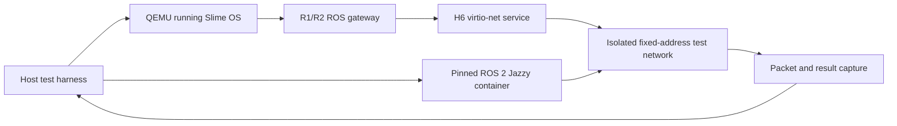

# ROS 2 compatibility track

**Status:** Not started.

This track makes ROS 2 a bounded compatibility profile over Slime's native typed data fabric. It does not make ROS, DDS, RTPS, a ROS graph, or a topic namespace part of the kernel ABI. Existing ROS binaries are R3 scope; R1 and R2 prove protocol interoperability with external ROS systems first.

## Compatibility baseline

The initial conformance target is pinned rather than described as generic “ROS 2 support”:

- ROS 2 Jazzy interface and name-mapping behavior;
- Fast DDS, the Jazzy default RMW implementation, as the first executable peer;
- Cyclone DDS as the second peer after the first corpus passes;
- DDSI-RTPS 2.5 wire framing and discovery subset;
- XCDR1 serialized payloads for the admitted type subset;
- exact generation-declared peers, domain, routes, directions, types, QoS, and bounds.

A later ROS distribution or middleware vendor is a new conformance profile until the same corpus proves compatibility. Cross-vendor behavior is not assumed from one passing implementation.

## What “ROS 2 protocol” means here

The compatibility surface has separate layers, each with its own fixtures:

1. ROS names and graph entities: node metadata, topics, services, and actions.
2. ROS interface definitions: message, service, and action types converted through a bounded ROSIDL/IDL subset.
3. ROS-to-DDS mapping: `rt/` topics, `rq/` service requests, `rr/` service replies, and the standard hidden entities used by actions.
4. Transport QoS: requested/offered compatibility and the explicitly admitted policies.
5. CDR serialization and DDSI-RTPS discovery/data exchange.

Passing one layer never implies support for the others.

## Authority boundary

- Native components receive route endpoint capabilities from the C8 fabric service; a ROS name string grants nothing.
- The ROS gateway holds only the exact C8 routes and H6 network destinations declared by the generation.
- Profile R1 admits only fixed peers with exact addresses, domain ID, participant-ID bounds, and predictable RTPS ports. Arbitrary LAN participants and unrestricted multicast discovery are out of scope.
- A configured multicast group is an exact network destination grant, not ambient LAN access.
- Discovery metadata returned to a local component is filtered to its graph-visibility grant.
- Slime capabilities never appear in CDR or RTPS payloads. A gateway may retain and proxy a capability only through an explicitly declared native route.
- DDS Security is not claimed by R1 or R2. Slime network confinement does not masquerade as DDS Security interoperability.

## Admitted interface subset

R1 accepts only normalized types whose maximum serialized size is known before activation:

- booleans, integers, floating-point values, bytes, characters, and admitted time/duration structures;
- nested admitted messages;
- fixed-size arrays;
- bounded strings and bounded sequences;
- deterministic field order, alignment, and type identity.

R1 rejects before staging:

- unbounded strings or sequences;
- recursive layouts without a finite declared bound;
- unsupported unions, annotations, representations, or extensibility modes;
- duplicate type names with different normalized layouts;
- any message whose declared maximum exceeds the route or shared-buffer quota.

The importer produces the same C8 `InterfaceSchema` identity used by native components. It does not create a second independent type system.

## TransportQoS profiles

### Profile 1: topics

- KEEP_LAST with explicit finite depth;
- RELIABLE with finite retry/resource limits;
- BEST_EFFORT;
- VOLATILE durability;
- requested/offered compatibility and matched/incompatible events.

There is no implementation-defined “system default” inside a generation: normalization resolves every policy to an explicit value.

### Profile 2: services and actions

Adds:

- bounded TRANSIENT_LOCAL history;
- deadline and lifespan;
- automatic and manual-by-topic liveliness;
- finite lease duration;
- service response and action-result retention bounds.

KEEP_ALL, infinite result retention, unbounded retransmission, and unbounded discovery caches remain unsupported.

## Sequencing

1. R1 depends on C8 and H6's deterministic network service and exact-destination authority.
2. R2 depends on R1 and consumes C8 operations plus the C9 lifecycle/time contracts where applicable.
3. R3 depends on R2 and either X1 or X2 from [`05-foreign-workloads.md`](05-foreign-workloads.md).
4. R1 and R2 do not depend on compositor, audio, Wi-Fi, GPU, local Linux/POSIX support, Python, or an on-device ROS build toolchain.

## Canonical conformance environment

R1 and R2 use a pinned host container as the executable protocol oracle. A Raspberry Pi is later physical interoperability evidence; it does not replace or block the deterministic container checks.



The canonical peer image is content-addressed and contains:

- ROS 2 Jazzy `ros-core` and exact package versions;
- Fast DDS and Cyclone DDS, selected through `RMW_IMPLEMENTATION` from the same image;
- fixed topic, service, and action probe executables rather than interactive shell scripts;
- the admitted `.msg`, `.srv`, and `.action` fixtures;
- fixed QoS profiles, packet capture, normalized result reporting, and malformed-peer fixtures;
- no runtime package download and no Internet route.

The image runs on the development host. It is an external ROS protocol peer, not a Slime container feature, and proves neither X1, X2, nor R3.

The isolated network uses fixed addresses from a documentation-only subnet, a fixed ROS domain, fixed participant bounds, predictable RTPS ports, and exact H6 `NetworkDestination` grants. Profile 1 uses configured initial peers/static discovery. Multicast discovery is a separate later fixture because Docker/Podman bridge modes and QEMU host networking do not provide a sufficiently deterministic canonical multicast environment.

### Fixture layers

| Layer | Evidence | R1/R2 gate |
| --- | --- | --- |
| L0 | golden name-mapping, type-identity, CDR, and QoS-compatibility fixtures | required |
| L1 | recorded RTPS packets plus malformed, loss, duplicate, reorder, and restart corpus | required |
| L2 | QEMU Slime ↔ pinned Jazzy/Fast DDS container | required |
| L3 | the same corpus with Cyclone DDS selected in the same image | required before closing the relevant profile |
| L4 | Framework Slime ↔ wired Raspberry Pi Jazzy peer | physical evidence after R1/R2; not a substitute for L0–L3 |
| L5 | Raspberry Pi sensor/actuator workload | later robot qualification, outside R1/R2 |

### R1 topic matrix

The canonical fixture covers both directions for RELIABLE and BEST_EFFORT, bounded fan-in and fan-out, primitive and nested types, fixed arrays, bounded strings/sequences, maximum admitted payloads, and C7 shared-buffer payloads. It separately checks incompatible reliability/durability, KEEP_LAST eviction, retry exhaustion, peer restart, duplicates, reorder, fragment loss, alternate domain/topic/type/peer/port, and every rejected unbounded or oversized type.

Packet capture is part of the authority proof: a denied route must emit no corresponding RTPS DATA packet, not merely return an application error.

### R2 service and action matrix

The canonical fixture covers both service directions, concurrent request identities, duplicate and stale requests, delayed/lost responses, timeout, server restart, and non-idempotent execution. Actions cover accept, reject, feedback, status, success, abort, cancel, result retrieval, result expiry, unauthorized observation/control, and gateway/server restart.

### Physical interoperability evidence

After R1 and R2 pass L0–L3, run a dedicated wired-Ethernet fixture between Framework Slime and a 64-bit Raspberry Pi 4 or 5 running the same pinned Jazzy probe packages. Record image/generation identity, Pi image/package identity, RMW selection, addresses, domain, packet capture, link unplug/replug, peer restart, exact allowed/denied destinations, and Framework storage-integrity evidence. Run Fast DDS and Cyclone DDS separately. Wi-Fi and real sensors are later fixtures so NIC, discovery, and protocol failures remain independently diagnosable.

## R1: ROS 2 topic wire profile

**Status:** Not started.

### Deliverables

- declare a versioned Slime ROS 2 Profile 1 contract containing ROS distribution, RMW peer, DDSI-RTPS version, domain, participants, admitted types, routes, direction, QoS, serialized-size bounds, history, discovery, and network locators;
- implement a deterministic bounded ROSIDL/IDL importer into C8 `InterfaceSchema`, plus generated or validated Rust bindings and golden CDR fixtures;
- implement XCDR1 serialization/deserialization with explicit encapsulation, endianness, alignment, string termination, sequence, nesting, and maximum-size checks before allocation;
- implement the DDSI-RTPS participant, writer, and reader subset needed for fixed-peer SPDP/SEDP discovery, matching, DATA, HEARTBEAT, ACKNACK, GAP, sequence tracking, fragmentation bounds, and teardown;
- apply the standard ROS topic name mapping, including `rt/`, and reject invalid or overlength ROS/DDS names during generation validation;
- map native C8 Stream endpoints to DDS writers/readers without exposing raw sockets or arbitrary graph creation to the component;
- implement Profile 1 QoS compatibility and translate matched, incompatible, loss, retry-exhaustion, peer-death, and unreachable conditions into structured native events;
- build a content-addressed host peer image with pinned Jazzy packages, Fast DDS and Cyclone DDS, fixed probes, no runtime downloads, normalized packet/result capture, and one command that selects the RMW without changing the fixture image;
- keep discovery and data caches within manifest participant, endpoint, locator, type, fragment, history, retry, and byte limits.

### Required checks

- a Jazzy/Fast DDS publisher sends an admitted topic to a native Slime subscriber and a native publisher sends the same type to a Jazzy/Fast DDS subscriber;
- reliable and best-effort routes pass independently with the declared finite resource behavior;
- name mapping, type identity, CDR bytes, sequence numbers, and requested/offered matching agree with the pinned peer fixtures;
- alternate domain, participant, peer address, port, topic, type, direction, and QoS attempts fail closed;
- a denied local route emits no corresponding RTPS DATA packet, and an undeclared remote writer cannot inject a native sample;
- malformed headers, submessage lengths, locators, parameter lists, CDR alignment, strings, sequences, fragments, ACK bitmaps, and sequence ranges fail before out-of-bounds access or unbounded allocation;
- discovery storms, retry exhaustion, fragment loss, duplicate data, reordering, peer restart, and gateway restart remain within fixed bounds and do not wedge unrelated native routes;
- the second-vendor corpus reports any incompatibility explicitly rather than widening the profile silently.
- the L0–L3 conformance layers all pass; Raspberry Pi or other physical evidence cannot replace a missing deterministic fixture.

### Planned verification target

```sh
just ros2_topic_check
```

### Exit condition

The content-addressed Jazzy peer container exchanges admitted bounded topics bidirectionally with native Slime components under both Fast DDS and Cyclone DDS selections through exact graph and network grants; reliable and best-effort behavior matches the profile, denied routes emit no data packet, and malformed or exhausted RTPS state cannot escape declared resource bounds. Raspberry Pi evidence is not required for R1 completion.

## R2: ROS 2 services and actions profile

**Status:** Not started.

### Deliverables

- implement standard ROS service request/reply DDS topic mapping, request identity, client routing, response correlation, timeout, cancellation, duplicate handling, and bounded server concurrency;
- map a ROS service onto a C8 `Call<Request, Reply>` route while preserving native peer-death, timeout, cancellation, and authorization errors;
- implement ROS actions as the standard three services and two topics: send goal, cancel goal, get result, feedback, and status;
- implement the accepted/executing/canceling/succeeded/aborted/canceled goal state machine with UUID validation, explicit transition checks, bounded active-goal count, and bounded result retention;
- add Profile 2 TransportQoS, including bounded transient-local status/history and finite deadline, lifespan, liveliness, lease, response, and result-cache durations;
- project admitted parameter and lifecycle services onto C9 state/lifecycle authority without giving the remote peer ambient parameter or component-control access;
- keep hidden service/action entities visible only through the appropriate graph grant and introspection request;
- extend the Fast DDS and Cyclone DDS conformance corpora with service, action, restart, duplicate, timeout, and cancellation fixtures.
- reuse the exact R1 peer image, network, capture, and RMW-selection mechanism rather than creating a second unpinned service/action environment.

### Required checks

- native and Jazzy peers call an admitted service in both directions and preserve request/response identity under concurrent clients;
- duplicate or stale requests never execute a declared non-idempotent operation twice; timeout and lost response remain distinguishable from server rejection and authorization denial;
- action accept, reject, feedback, status, success, abort, cancel, and result retrieval agree with the pinned Jazzy peer;
- an unauthorized client cannot send a goal, cancel another goal, retrieve a result, observe feedback/status, mutate parameters, or change lifecycle state;
- action status/history and result caches obey their finite count, byte, and duration bounds, including after server or gateway restart;
- malformed UUIDs, illegal goal transitions, cancellation races, duplicate results, expired results, and transient-local replay fail deterministically without leaking active-goal state;
- incompatibility with either pinned middleware is reported as a profile gap, not hidden by vendor-specific ambient configuration.
- the service/action L0–L3 corpus passes under both Fast DDS and Cyclone DDS selections; physical Raspberry Pi runs remain supplementary evidence.

### Planned verification target

```sh
just ros2_service_action_check
```

### Exit condition

The content-addressed Jazzy peer container and native Slime components call services and execute, observe, cancel, and retrieve actions bidirectionally under both Fast DDS and Cyclone DDS selections through declared graph and network authority; correlation and state transitions remain exact across retries and restarts, while every queue, retained sample, active goal, and result has a finite enforced bound. Raspberry Pi evidence is not required for R2 completion.

## R3: Existing ROS workload route

**Status:** Not started.

R3 runs existing ROS client-library workloads locally. It is explicitly not an R1/R2 exit requirement.

### Supported routes

- `rmw_slime`: source-port a bounded ROS client/runtime surface directly onto C8/C9; or
- X1 personality: run a Linux userspace ROS process with filesystem, network, clock, randomness, and process behavior translated to explicit Slime services; or
- X2 guest VM: run a higher-fidelity Linux ROS environment whose virtio devices are backed only by granted Slime services.

The selected route is generation data. Moving a workload between routes cannot widen its grants.

### Deliverables

- pin the exact Jazzy packages, build artifacts, route, supported client-library surface, and rejected operating-system assumptions;
- package every executable, shared object, interface, configuration, and resource as content-addressed generation objects or explicitly granted state;
- map ROS domain, remapping rules, parameters, logs, clocks, files, network peers, devices, process creation, and scheduling class to explicit generation data and capabilities;
- deny unsupported syscalls, package discovery, plugin loading, dynamic types, transports, or middleware options with stable structured/errno behavior;
- run unmodified pinned `demo_nodes_cpp` topic/service/parameter workloads and an `action_tutorials_cpp` client/server pair through the selected route;
- expose the workload's complete possible authority to manifest graph and authority-diff tooling.

### Required checks

- the pinned packages run without adding native global paths, package indexes, environment inheritance, raw sockets, or unrestricted DDS discovery;
- child processes, composed nodes, plugins, and dynamically created ROS entities cannot exceed the parent workload's declared grants or quotas;
- the same R1/R2 conformance fixtures pass between the local existing workload and native components;
- missing filesystem, network, clock, randomness, device, or scheduling authority fails through the selected compatibility boundary rather than being fabricated;
- workload restart, generation rollback, and route change retain only declared persistent state and cannot retain stale endpoints, secrets, buffers, or network sessions.

### Planned verification target

```sh
just ros2_workload_check
```

### Exit condition

The pinned unmodified Jazzy demo and action packages run locally through one declared compatibility route, interoperate with native C8 components, and remain confined to generation-declared filesystem, network, clock, randomness, scheduling, graph, and device authority with stable rejection for everything else.

## Conformance references

- [ROS 2 Jazzy middleware/RMW boundary](https://docs.ros.org/en/jazzy/Concepts/Intermediate/About-Different-Middleware-Vendors.html)
- [ROS 2 Jazzy QoS policies and compatibility](https://docs.ros.org/en/jazzy/Concepts/Intermediate/About-Quality-of-Service-Settings.html)
- [ROS topic and service name mapping to DDS](https://design.ros2.org/articles/topic_and_service_names.html)
- [ROS 2 action protocol](https://design.ros2.org/articles/actions.html)
- [OMG DDSI-RTPS 2.5](https://www.omg.org/spec/DDSI-RTPS/2.5/)

These references define the target to test against; they do not waive Slime's deterministic bounds or authority invariants.
