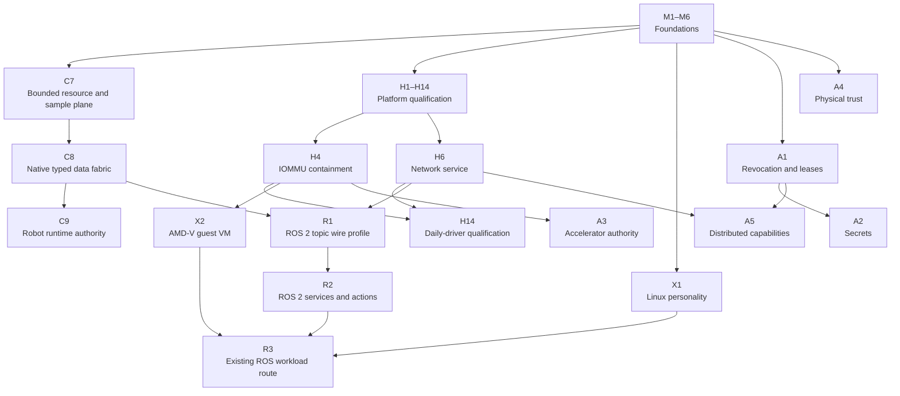
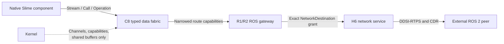

# Slime OS roadmap

This directory is the canonical plan for Slime OS. It separates mechanism, protocol compatibility, physical-platform qualification, foreign workloads, and authority work so unrelated hardware does not impose a false total order on the system architecture.

A milestone is complete only when its exit condition is observed. Compiled code, a framebuffer demo, or a narrowed unit test is not completion. QEMU is the deterministic architecture target; a physical support claim additionally requires recorded behavior on the named Framework target.

## Current state

| Track | Status | Next open gate |
| --- | --- | --- |
| [Foundations](01-foundations.md) | M1–M4 and M6 complete; M5 mechanisms complete | Record M5.7 removable-media Framework evidence without internal-NVMe modification |
| [Core runtime](02-core-runtime.md) | Not started | C7 bounded resource and shared-sample plane |
| [ROS 2 compatibility](03-ros2-compatibility.md) | Not started | Admit R1 only after C8 and the H6 network-service contract exist |
| [Platform hardware](04-platform-hardware.md) | H1 implementation complete; physical evidence pending | Record H1 topology/input/storage evidence; implement H2 driver authority ABI |
| [Foreign workloads](05-foreign-workloads.md) | Not started | X1 Linux userspace personality |
| [Authority and trust](06-authority-trust.md) | Not started | A1 revocation/leases and A2 secrets after their core dependencies |

The active work lanes are deliberately parallel:

- **Evidence lane:** close M5.7 and H1 with an observed removable-media Framework run.
- **Architecture lane:** implement C7 without waiting for compositor, audio, wireless, or GPU work.
- **Platform lane:** implement H2 and H4 before promoting any DMA-capable physical driver.

No lane may use progress in another lane to claim an unobserved exit condition.

## Track map



## ROS 2 architecture boundary



Dependencies are minimum prerequisites, not permission to add ambient authority. In particular:

- ROS 2 compatibility is a userspace profile over native Slime contracts, never a kernel ABI.
- DDSI-RTPS carries typed data, not Slime capabilities. A5 distributed capabilities is a separate cryptographic authority protocol.
- Existing ROS binaries are R3 scope. R1 and R2 prove protocol interoperability without importing Linux, POSIX, a global filesystem, or an ambient network model.
- Hardware track completion never substitutes for core fault, bounds, schema, or authority checks.

## Architectural invariants

Every track preserves these rules:

1. The kernel owns only privileged mechanisms: scheduling, address spaces, memory objects, capability enforcement, IPC, interrupts, timers, and minimal platform control.
2. Device, filesystem, generation, graph, discovery, QoS policy, health, activation, and rollback policy live in userspace services.
3. Authority is carried by explicit capabilities. There are no ambient executable paths, storage handles, working directories, streams, network destinations, discovery domains, or environment state.
4. New kernel objects or rights update `../docs/capability-matrix.md` in the same change and ship with a real gate.
5. New IPC protocols are schema-first under `../contracts/`; generated or validated bindings cannot disagree on layout.
6. Generation, storage, protocol, queue, retry, history, and payload data are deterministic, versioned, bounded, integrity checked, and rejected when malformed or unsupported.
7. Activation never overwrites the running generation in place, and a failed pending generation cannot consume the last selectable boot root.
8. A QEMU pass cannot complete a physical-machine milestone.
9. Internal Framework NVMe writes remain disabled until the H7 bounds, IOMMU, timeout/reset, flush-ordering, interruption, identity, malformed-metadata, rollback, and recovery gates all pass.

## Release gates

Track milestones compose into observable releases rather than one global milestone number.

### Native architecture release

Requires M1–M6, C7, and C8. A release must boot a generation, run isolated native components, move bounded typed samples and calls through capability-routed services, survive a peer fault, and roll back a failed pending generation.

### ROS-interoperable QEMU release

Requires the native architecture release, H6's deterministic virtio-net backend and network authority contract, then R1 and R2. The canonical oracle is one content-addressed host ROS 2 Jazzy peer image: Fast DDS and Cyclone DDS run the same fixed probes, network, packet capture, and malformed-input corpus. Only declared topics, services, and actions may cross; denied graph edges emit no corresponding data packet. A wired Framework ↔ Raspberry Pi run supplies later physical and heterogeneous-platform evidence but cannot replace the deterministic container gates.

### Framework daily-driver release

Requires H1–H14 and all physical evidence named in the hardware track. It is independent of whether existing ROS binaries run locally.

### Existing-workload release

Requires X1 or X2 plus R3 for existing ROS workloads. The workload's complete filesystem, network, time, randomness, scheduling, and device authority must be generation-declared and visible to audit tooling.

### Distributed-authority release

Requires A1 and A5 plus H6 networking. Revocation, partition, unreachable, and replay failures remain distinguishable structured errors; RTPS interoperability alone does not satisfy this gate.

## Verification policy

Use the narrowest target named by each slice. Permanent Rust changes also run the repository format and lint gates. Generation or contract changes run `just generation_check` and `just contracts_check`. Hardware promotion includes the exact physical evidence record required by the relevant H slice.

The repository-wide gates remain:

```sh
just contracts_check
just generation_check
just test
just fmt_check
just lint
just fmt_check_components
just lint_components
just framework_safety_check
```

Documentation-only roadmap edits do not run runtime tests; their verification is link, status, identifier, and content consistency.

## Updating this roadmap

- Update the owning track file, not this index, for detailed deliverables and checks.
- Update this index when track status, dependency edges, or release composition changes.
- Preserve completed evidence; do not rewrite an observed check as a future intention.
- Move exploratory work from `../docs/directions/` only after it has dependencies, bounded deliverables, required checks, and an observable exit condition here.
- Never mark a milestone complete from implementation status alone when its exit condition requires QEMU or physical evidence.
