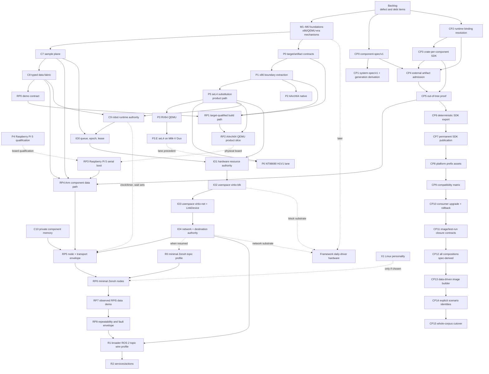

# Slime OS roadmap

**This directory is architectural documentation, not the canonical plan.** Work-item
identity, state, hierarchy, and dependencies live in `.tasks/items/`, one Markdown
file per item under a canonical UUID, managed by [MyQue](https://github.com/mozufu/myque).
The headings below allocate no identity: ids such as `C9.4`, `IO4`, and `B92` are
display aliases carried as MyQue keys, and only a UUID is a reference. Read
`just tasks_list` for state, `just tasks_next` for what is actionable, and
`just tasks_graph` for dependencies; read this directory for the reasoning,
boundaries, and sequencing that no work-item body should have to restate.

The current physical execution goal is:

> **Boot upstream seL4 and a verified Slime generation on the named Milk-V Duo, then replay the architecture-neutral root and component evidence through its observed hands-off deployment and serial loop.**

Milk-V Duo is the current physical bring-up target because it is the only available board with an observed, repeatable USB-NCM deployment and serial evidence path. This is a narrow execution pivot, not a product-equivalence claim: the Raspberry Pi 5 ROS 2 demo and Framework daily-driver releases remain defined and deferred, and Duo evidence cannot satisfy their board-, storage-, DMA-, input-, display-, network-, suspend-, or trust-specific gates.

A milestone is complete only when its exit condition is observed. Compiled code, a custom payload, a passing QEMU run, or evidence from a different physical target cannot close a board-specific milestone.

## Tracks

What each track owns and where its boundary is. Deliberately no state: which
items are done, open, deferred, blocked, or actionable is the store's answer,
and `just tasks_list` / `just tasks_next` / `just tasks_graph` are how it is
read. A hand-maintained count or "next open gate" here would be a second
record that drifts the moment an item closes, which is why there is none.

| Track | Owns | Boundary |
| --- | --- | --- |
| [Backlog](00-backlog.md) | Nothing live: a frozen index of the pre-cutover `B<N>` anchors that devlog entries link into | The backlog itself is the `backlog`-tagged items in the store, and open ones precede milestone work |
| [Foundations](01-foundations.md) | The x86/QEMU-era mechanisms the later tracks were built on, and the Framework removable-media boot claim | A Framework claim requires observed removable-media boot with no internal-NVMe write; no other board's evidence substitutes |
| [Core runtime](02-core-runtime.md) | The typed data fabric, robot-runtime authority (clock/timer, wait sets, scheduling class, lifecycle policy, determinism claims), and task-private component memory | Mechanism stays in `slime-root`; policy — supervision decisions, health, QoS — is a userspace component's. Runtime memory is task-private, generation-bounded, never executable, and fully reclaimed |
| [Component platform](10-component-platform.md) | `component-spec/v1` through `system-spec/v1`: immutable component sources, target-qualified platform prefixes, external artifact admission, compatibility evidence, upgrade, rollback, and closure identity as the reproducible build key | A closure is an identity over declared inputs; the handful of plane gates a closure structurally cannot describe stay outside it |
| [RPi5 ROS 2 demo](09-rpi5-ros2-demo.md) | The two-node bounded-topic demo contract and its target-qualified build path | Only a physical Raspberry Pi 5 run satisfies its board claim; `aarch64-qemu-virt` evidence is regression coverage, not the demo |
| [Architecture portability](07-architecture-portability.md) | Target/artifact contracts, the x86 boundary extraction, the seL4 substitution, and the RV64 Duo and NT98690 H1V1 physical lanes | An architecture lane proves capability, fault, wait/wake, reclamation, generation, and rollback parity — not storage, USB, network, display, sensor, or actuator support, and never another board's gate |
| [Native I/O substrate](11-io-substrate.md) | Request/epoch/lease/queue semantics, bounded device/MMIO/IRQ/DMA authority with reclamation on death, the userspace virtio-blk and virtio-net drivers, exact-destination networking, and the host models and proofs under them | Trusted DMA on QEMU with no containment claim. IO4's authority boundary is separate from its network data plane, and an unimplemented protocol layer is unclaimed rather than implied |
| [ROS 2 compatibility](03-ros2-compatibility.md) | The frozen bounded topic wire profile and the authority model beneath it | Wire interoperability grants nothing: names, types, domains, and destinations still need explicit capabilities. Resumes with the robotics demo |
| [Platform hardware](04-platform-hardware.md) | Framework daily-driver device authority and its inventory/no-write record | Waits on a seL4 Framework image and observed physical evidence, which no Duo or QEMU run supplies |
| [Foreign workloads](05-foreign-workloads.md) | An optional Linux userspace personality | Only pursued for a selected product workload that needs one |
| [Authority and trust](06-authority-trust.md) | The trust primitives above capabilities | Each is pulled in by a product or hardware release that needs it, not built speculatively |
| [Native development](08-native-development.md) | On-device build and live update | Waits on a stable physical product path |

## Physical bring-up sequencing

The P3/P3.E [Architecture portability](07-architecture-portability.md) sequence is complete:

1. **RV64 reference profile:** the pinned `riscv64-sel4-qemu-virt` profile replays the architecture-neutral corpus.
2. **Duo platform risks:** the 63.25 MiB memory fit, PLIC context, and C906 MAEE/page-table behavior are measured and explicit.
3. **Physical seL4 and generation:** elfloader, upstream seL4, `slime-root`, and the exact `riscv64-sel4-milkv-duo` generation boot on the named board.
4. **Component and fault evidence:** three sample-plane runs produce byte-identical normalized traces with zero framing errors; a fourth run emits the bounded early-fault diagnostic.
5. **Recovery:** every boot autonomously cold-resets to vendor Linux.
6. **Next decision boundary:** choose a product workload only through a new roadmap item; architecture completion does not imply ROS, storage, network, USB, display, sensor, actuator, Raspberry Pi 5, or Framework support.

[P6](07-architecture-portability.md#p6-novatek-nt98690-ns02201-h1v1-physical-lane) opens a second physical lane on the Novatek NT98690 H1V1 in the same order, and for the reason P4 is stuck: that board's vendor firmware keeps a serial console alive and its own tooling already drives it, so the ordered-marker evidence exists there. P6.A qualifies the firmware handoff and measures the board's facts, P6.B ports seL4 and `slime-root` onto that handoff, and P6.C adds the shell. It substitutes for no other board's gate.

The [backlog](00-backlog.md) still sits ahead of all lanes: resolve or explicitly defer open defects before opening a new roadmap gate. A green verification suite is a precondition for milestone work, not a milestone itself.

## Track map

Sequencing only: which track's result another track's work rests on. It is a
reading aid over the prose above, not a dependency graph — the store owns
dependency edges and `just tasks_graph` renders them, so no node here carries
state and no edge here is authority.

```mermaid
flowchart TD
    Backlog["Backlog\ndefect and debt items"]
    Foundations["M1–M6 foundations\nx86/QEMU-era mechanisms"]
    C7["C7 sample plane"]
    C8["C8 typed data fabric"]
    P0["P0 target/artifact contracts"]
    P1["P1 x86 boundary extraction"]
    P2["P2 AArch64 native"]
    P5["P5 seL4 substitution\nproduct path"]
    P4["P4 Raspberry Pi 5 qualification"]
    C9["C9 robot runtime authority"]
    C10["C10 private component memory"]
    IO0["IO0 queue, epoch, lease"]
    IO1["IO1 hardware resource authority"]
    IO2["IO2 userspace virtio-blk"]
    IO3["IO3 userspace virtio-net + LinkDevice"]
    IO4["IO4 network + destination authority"]
    CP0["CP0 component-spec/v1"]
    CP1["CP1 system-spec/v1 + generation derivation"]
    CP2["CP2 runtime binding resolution"]
    CP3["CP3 crate-per-component SDK"]
    CP4["CP4 external artifact admission"]
    CP5["CP5 out-of-tree proof"]
    CP6["CP6 deterministic SDK export"]
    CP7["CP7 permanent SDK publication"]
    CP8["CP8 platform prefix assets"]
    CP9["CP9 compatibility matrix"]
    CP10["CP10 consumer upgrade + rollback"]
    CP11["CP11 image/test-run closure contracts"]
    CP12["CP12 all compositions spec-derived"]
    CP13["CP13 data-driven image builder"]
    CP14["CP14 explicit scenario identities"]
    CP15["CP15 whole-corpus cutover"]
    R0["R0 minimal Zenoh topic profile"]
    RP0["RP0 demo contract"]
    RP1["RP1 target-qualified build path"]
    RP2["RP2 AArch64 QEMU product slice"]
    RP3["RP3 Raspberry Pi 5 serial boot"]
    RP4["RP4 Arm component data path"]
    RP5["RP5 node + transport envelope"]
    RP6["RP6 minimal Zenoh nodes"]
    RP7["RP7 observed RPi5 data demo"]
    RP8["RP8 repeatability and fault envelope"]
    R1["R1 broader ROS 2 topic wire profile"]
    R2["R2 services/actions"]
    Framework["Framework daily-driver hardware"]
    RV64["P3 RV64 QEMU"]
    Duo["P3.E seL4 on Milk-V Duo"]
    H1V1["P6 NT98690 H1V1 lane"]
    X1["X1 Linux personality"]

    Backlog --> Foundations
    Foundations --> C7 --> C8
    Foundations --> P0 --> P1 --> P5
    P1 --> P2
    P5 --> RV64 --> Duo
    P5 --> H1V1
    Duo -.->|lane precedent| H1V1
    C8 --> RP0
    P0 --> RP1
    P1 --> RP1
    RP0 --> RP1 --> RP2 -.->|physical board| RP3 --> RP4 --> RP5 --> RP6 --> RP7 --> RP8
    P5 --> RP2
    P4 -.->|board qualification| RP3
    C7 --> RP4
    C8 --> RP4
    Backlog --> CP0
    Backlog --> CP2
    CP0 --> CP1
    CP2 --> CP3
    CP0 --> CP4
    CP2 --> CP4
    CP3 --> CP4
    CP3 --> CP5
    CP4 --> CP5
    CP5 --> RP4
    CP5 --> CP6 --> CP7 --> CP8 --> CP9 --> CP10 --> CP11 --> CP12 --> CP13 --> CP14 --> CP15
    C8 --> C9
    P5 --> C9
    C10 --> RP5
    C7 --> IO0
    C9 --> IO0
    P5 --> IO1
    IO0 --> IO1 --> IO2 --> IO3 --> IO4
    IO4 --> RP5
    C9 -.->|clock/timer, wait sets| RP5
    IO4 -.->|when resumed| R0 --> RP6
    X1 -.->|only if chosen| RP6
    RP8 --> R1 --> R2
    IO4 --> R1
    Foundations -.->|later| Framework
    IO2 -.->|block substrate| Framework
    IO4 -.->|network substrate| Framework
```

## RPi5 ROS 2 demo boundary

The demo is intentionally narrower than “full ROS 2 support”:

- It proves **two local Slime-hosted ROS 2 nodes** on Raspberry Pi 5 exchanging one or more bounded topic samples through the admitted minimal bounded Zenoh profile.
- The selected route must be generation-declared, target-qualified, and carried by a real ROS 2 middleware wire protocol. Native C8 fabric may back internal delivery, but the demo cannot be claimed from a local-only ROS-like API that skips the middleware wire entirely.
- The transport family is replaceable generation data rather than an architectural commitment: `contracts/rpi5-ros2-demo/v2` names it through a closed discriminator plus one optional profile per admitted family.
- It does **not** require arbitrary middleware discovery, a Zenoh router, gossip or multicast scouting, liveliness tokens, unrestricted LAN communication, multiple middleware vendors, services/actions, unmodified desktop ROS packages, Python, Gazebo, compositor support, Wi-Fi, GPU acceleration, or Framework hardware support.
- It does not put ROS or middleware concepts in the kernel. Nodes, topics, sessions, publishers/subscribers, executors, QoS policy, and graph metadata remain userspace contracts over capabilities, C8 routes, and exact stream/network grants.
- A Raspberry Pi 5 run must be physical evidence for the named board; `aarch64-qemu-virt` evidence is necessary regression coverage but cannot replace it.

## Architectural invariants

Every track preserves these rules:

1. Privileged mechanism only: seL4 owns scheduling, address spaces, memory objects, capability enforcement, IPC, interrupts, and timers; `slime-root` owns the dynamic mechanism above them — generation admission, task/resource construction and reclamation, bounded object allocation, shared buffers, explicit hardware-resource grants, and fault supervision. Neither owns device semantics or policy.
2. Device, filesystem, generation, graph, discovery, QoS policy, health, activation, rollback, and ROS node policy live in userspace services. Drivers consume explicit hardware capabilities and expose typed semantic capabilities; shared queues, leases, completions, Notifications, and WaitSets do not create a generic device protocol.
3. Authority is carried by explicit capabilities. There are no ambient executable paths, storage handles, device enumeration, DMA addresses, working directories, streams, network destinations, discovery domains, or environment state.
4. New object kinds or rights update `../docs/capability-matrix.md`, and new or renumbered operations update `../docs/syscall-abi.md`, in the same change, and ship with a real gate. Both are now gated rather than trusted: the rights vocabulary and the operation-label table are declared in `../contracts/` and generated, and `just contracts_check` fails when `syscall-abi.md` does not document every declared label (B57, B59).
5. New IPC, I/O, ROS profile, demo trace, and persistent protocols are schema-first under `../contracts/`; generated or validated bindings cannot disagree on layout. Device-specific requests remain separate protocols and never become variants of one universal opcode.
6. Generation, storage, protocol, queue, request epoch, lease, retry, history, payload, and demo evidence data are deterministic, versioned, bounded, integrity checked, and rejected when malformed, stale, or unsupported.
7. Activation never overwrites the running generation in place, and a failed pending generation cannot consume the last selectable boot root. A generation in a superseded wire format counts as failed: the root refuses it (`UnsupportedVersion`, distinct from `BadMagic`) rather than migrating it, and the selector spends the pending attempt before decoding, so an undecodable candidate rolls back to known-good within its declared attempts instead of retrying forever. Format bumps are therefore *not* rollback-compatible by migration — they are rollback-*safe* by refusal, which `just sel4_boot_selection_check` observes (B64). Superseded `contracts/generation/vN` schemas are retained as format history and type-checked, never generated from.
8. QEMU cannot complete a physical milestone, and evidence from Milk-V Duo, Raspberry Pi 5, or Framework cannot complete another board's target-specific gate.
9. Every executable generation names one exact admitted target profile; the immutable disk-backed selector and root admission reject architecture, ABI, page-profile, and required-feature mismatches before mapping executable bytes.
10. Architecture ports preserve the same capability, fault, wait/wake, resource-reclamation, generation, and rollback semantics. ISA-specific register frames and page tables are mechanisms, not portable contracts.
11. ROS wire or node interoperability is not authority. Names, types, domains, graph visibility, parameters, files, devices, and network destinations grant nothing without explicit capabilities.
12. Component memory obtained at runtime is task-private, generation-bounded, never executable, and fully reclaimed on termination. Growth is a budgeted mechanism, not an ambient allocator.

## Release gates

### RV64 Milk-V Duo architecture release

Requires P3, P3.D, and P3.E. The release must boot a target-qualified verified generation through upstream seL4 on the named Duo, reach `slime-root` ready, reject incompatible artifacts before mapping executable bytes, and replay the selected architecture-neutral root/component corpus with physical serial evidence. It does not claim a product workload or qualify untested storage, USB, network, display, sensor, or actuator paths.

### RPi5 ROS 2 two-node demo release

Deferred, with RP0–RP2 retained as completed evidence. It still requires RP0–RP8 and the IO slices RP5 consumes; only a physical Raspberry Pi 5 run can satisfy its board-specific release claim. Duo or QEMU evidence cannot substitute.

### AArch64 native architecture release

Requires P0, P1, and P2. It remains valid architecture evidence for `aarch64-qemu-virt`, but is not Raspberry Pi 5 or Milk-V Duo hardware evidence.

### ROS-interoperable external wire release

Deferred with the robotics demo unless explicitly reprioritized. R0 proves the minimum topic path; R1/R2 broaden it to external `rmw_zenoh` peers, services, and actions.

### Framework daily-driver release

Deferred. It still requires Framework H1–H14 plus the common IO slices each H milestone consumes. No Duo architecture, serial, storage, or component evidence satisfies a Framework-specific gate.

### Existing-workload release

Deferred unless selected as the implementation route for a future product workload. Any backend must be admitted for that workload's exact target profile rather than inherited from x86-64 or another architecture.

## Verification policy

Use the narrowest target named by each slice. Permanent Rust changes also run the repository format and lint gates. Generation or contract changes run `just generation_check` and `just contracts_check`. Architecture changes run the target-specific QEMU gate before any physical board claim. Milk-V Duo promotion requires the P3 RV64 QEMU corpus plus a recorded Duo run with exact image, firmware, generation, memory-placement, and serial evidence. Raspberry Pi 5 and Framework promotion retain their own recorded board and device-authority requirements.

Documentation-only roadmap edits do not run runtime tests; their verification is link, identifier, and content consistency, guarded by `just devlog_check` when devlog entries are added or touched and by `just tasks_check` when the work-item store changes.

## Updating this directory

- **State never comes here.** Close an item with `myque close`, which records the closure date, and record the exit condition that was *observed* in the item's body. Never allocate an id by scanning for the next number, and never edit this directory to change what an item's state is: nothing reads `roadmap/` for identity, state, or dependencies, and no mechanism turns an edit here into a store change.
- Update the owning track file, not this index, for detailed rationale and boundaries.
- Update this index when a track's ownership, boundary, sequencing, or release composition changes — not when an item's state does. Exact counts, per-track status, and "what is open" belong to `just tasks_list` and `just tasks_next`; writing them here recreates the drift this cutover removed.
- Preserve completed evidence; do not rewrite an observed check as a future intention.
- When a milestone's work lands, replace its specification body with the outcome: one `**Delivered:**` sentence, one `**Exit condition (observed):**` sentence, a `**Gates:**` line naming the exact Justfile targets, and an `**Evidence:**` link to the devlog entry. Those are a frozen record of what was observed, not live state. Delete the `Deliverables`, `Required checks`, and `Verification target` sections — they described work that is now done, and `01-foundations.md` is the reference for the resulting shape.
- `Preserve completed evidence` is satisfied by a reachable devlog link, not by retaining the specification prose in this directory. A completed milestone whose evidence is only readable here has not been recorded properly.
- Move exploratory work from `../docs/directions/` only after it has dependencies, bounded deliverables, required checks, and an observable exit condition — and create the work item that owns it.
- Never treat a milestone as complete from implementation status alone when its exit condition requires QEMU or physical evidence.
- **A heading is a URL.** 77 merged devlog links name a `#fragment` in this directory, so rewording a heading breaks an inbound link while leaving the file in place — a failure with no symptom at the destination. `just devlog_check` validates every fragment. When a heading must change, keep the old address by putting `` on its own line above the new heading; that is what the two P4 and P5.4.9 anchors are.
