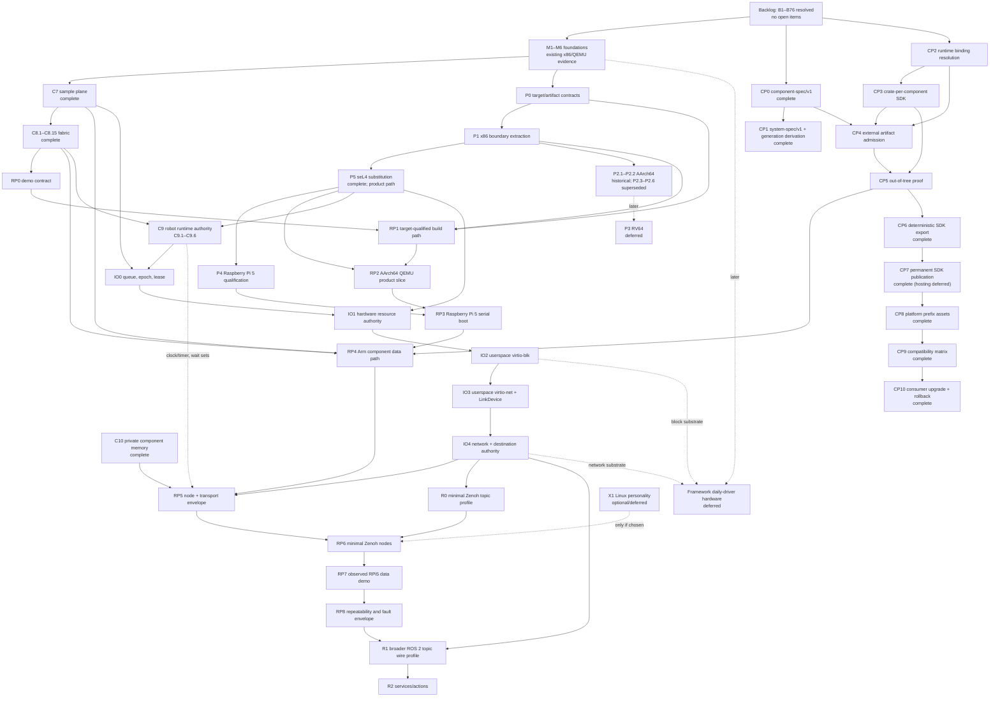

# Slime OS roadmap

This directory is the canonical plan for Slime OS. The near-term product goal is now a concrete robotics demonstration:

> **Boot Slime OS on a Raspberry Pi 5 and run two local ROS 2 nodes that exchange bounded topic data through a minimal bounded Zenoh profile with classic CDR payloads.**

Everything below is ordered around that acceptance test. Completed x86-64/QEMU work remains valuable regression evidence, but it is no longer the product-leading path. Framework daily-driver work, broad external ROS compatibility beyond the minimum topic path, RV64, foreign workloads, and distributed authority are deferred unless they directly de-risk the Raspberry Pi 5 ROS 2 two-node demo.

A milestone is complete only when its exit condition is observed. Compiled code, a framebuffer demo, a passing host unit test, or an x86-only QEMU run cannot close a Raspberry Pi 5 milestone.

## Current state

| Track | Status | Next open gate |
| --- | --- | --- |
| [Backlog](00-backlog.md) | B1–B76 resolved; **no open items** — B70 closed 2026-08-22 when the last nine `fabric_profile` `include!` sites became authenticated `fabric-graph` header fields, `RuntimeLimits` queries, and published contract constants, and `components/build-support` stopped reading manifests entirely | No open backlog item gates the next milestone. B61/B63/B65 each record a deliberately deferred half a future audit should start from |
| [Foundations](01-foundations.md) | M1–M4 and M6 complete; M5 mechanisms complete except M5.7 physical Framework evidence | M5.7 requires observed removable-media Framework boot without internal-NVMe writes |
| [Core runtime](02-core-runtime.md) | C7 and all of C8 (C8.1–C8.15) complete; the C8 track closed 2026-08-17 with C8.14's fault-isolation envelope and C8.15's aggregate determinism gate. **C10 closed 2026-08-24** across C10.1–C10.4: one task-private 2 MiB window per child, an authenticated `private-memory-budget/v1` resource fixing every component's ceiling, a `GlobalAlloc` over that region, and adoption by `fabric-service` — the graph's own broker, in ten fixtures — which now sizes its role and frame tables from the graph a generation declares rather than from the contract's ceilings, freeing 29960 bytes of `.bss` plus `.data` per generation. A repeated spawn/exit cycle returns the frame allocator's own watermarks exactly, and a shared buffer cannot be mapped into a private window. **C9 closed 2026-08-26** across C9.1–C9.6: a root-brokered clock/timer service behind declared authority, a bounded userspace wait set that blocks once per ready set on one declared Notification and recovers every ready source from the coalesced badge word, a declared scheduling class whose band mapping is manifest data — the builder reads it once and writes the resulting priority into the `ScheduleRecord`, so a class *is* a priority rather than a second number beside one — a `lifecycle-policy/v1` transition graph, restart bound, health dependency set, and parameter authority under which a *userspace* supervisor restarts a failed component while the root charges the declared attempt and refuses everything the policy does not admit, and a generation can declare a component deterministic with the claim constrained to the authority a recorder genuinely captures. **C9.6 closed 2026-08-26**: a simulated sensor → controller → actuator graph on the `sel4-robot-runtime` plane, the controller a dual-contract-kind participant, running to completion under declared best-effort contention and surviving an injected controller restart with its fabric authority reissued, asserted by a two-boot semantic trace comparison. Both of RP5's named dependencies on this track are therefore closed. | The track is fully closed; nothing remains open. RP5's two named dependencies (C9.3, C9.4) are met, and C9.5's `recorded` source set is still clock-only — widening it is its own follow-up, not a C9 milestone.
| [Component platform](10-component-platform.md) | **CP0–CP10 complete**, closing 2026-08-25 across CP6–CP10: `contracts/component-sdk-release/v1` describes an export, `scripts/lib/component_sdk.py` is the only thing that produces one, publication exports a detached checkout of the commit it records so a mirror commit regenerates byte-for-byte, each release ships a content-addressed seL4 prefix per target profile so an external build reads nothing under `slime_os/build/`, two real releases are classified against each other with every published matrix row backed by a build plus the boot that observed it, and a template consumer upgrades, boots, survives five injected failures, and reproduces the previous ELF and generation byte-for-byte on rollback | CP7's hosted-publication clause: every arm ran against a local clone of the canonical repository, so the first hosted commit needs the recorded source commit on `origin` and a release key outside this repository |
| [RPi5 ROS 2 demo](09-rpi5-ros2-demo.md) | RP0, RP1, and RP2 complete. RP2 closed 2026-08-20 with `sel4-demo.zti`, the first generation carrying the C7 data path, the C8 route graph, and the product component graph together, plus the rollback and wrong-target arms it owed the demo; RP3–RP8 planned | RP3's Raspberry Pi 5 serial boot, deferred with P4 on a working USB-UART adapter |
| [Architecture portability](07-architecture-portability.md) | P0, P1, P2.1, P2.2, and P5 complete; P2.3–P2.6 superseded by P5. P4's build path landed 2026-08-24: `bcm2712` is a second reproducible seL4 build platform with its own pinned artifact hashes, a forked `rust-sel4` supplying the loader platform upstream lacked, and a flat `kernel8.img` builder, all behind `just sel4_rpi5_image_check`/`just rpi5_media_check` | P4's board boot, **deferred on hardware**: artifacts and `just rpi5_boot_check` are ready and fail closed; the USB-UART adapter on hand emits nothing, and the debug UART is seL4's only console (it ships no display driver) |
| [Native I/O substrate](11-io-substrate.md) | IO0–IO7 complete; IO2's root cutover closed 2026-08-29, and IO5/IO6/IO7 added the track's host verification layers the same day. Five QEMU gates: `io_queue_check`, `io_driver_authority_check`, `io_block_check`, `io_link_check`, `io_network_check`, all registered in `sel4_gate_control_check`; two host model gates, `io_queue_model_check` and `io_resource_model_check`, registered in `contracts_check`; two host proof gates, `kani_io_proofs` and `kani_virtio_proofs` | IO0 fixes request/epoch/lease/queue semantics; IO1 grants bounded device/MMIO/IRQ/DMA authority with numeric reclamation on death; IO2's userspace virtio-blk is now the only product block path; IO3 proves userspace virtio-net duplex on the same substrate; IO4 enforces exact-destination networking, with IPv6/DHCP/SLAAC/listen declared and refused; IO5 quantifies IO0's lease/epoch rules and IO1's charge conservation over every interleaving rather than one schedule, with 13 must-fail mutations; IO6 proves the wire arithmetic those models disclaim — slot indexing, cursor subtraction, slice bounds — of the shipped source over every value of the declared types, with 18 must-fail mutations; IO7 closes the *device* side after B86/B87 showed it unguarded, proving used-ring index, descriptor-id, and transfer-length handling over all values with 13 harnesses and 8 must-fail mutations. All trusted-DMA on QEMU — no containment claim |
| [ROS 2 compatibility](03-ros2-compatibility.md) | Not started | R0 minimal Zenoh topic profile is first; broader external compatibility follows after the RPi5 demo path. The transport family is generation data, so it can be replaced without a new contract format |
| [Platform hardware](04-platform-hardware.md) | Deferred; H1 is blocked and no current seL4 Framework inventory or physical evidence exists | H1 remains blocked until a seL4 Framework image and observed inventory/no-write record exist |
| [Foreign workloads](05-foreign-workloads.md) | Deferred | Use only if the chosen ROS 2 node route requires a Linux userspace personality |
| [Authority and trust](06-authority-trust.md) | Deferred | Resume after the demo unless a demo milestone needs a specific authority primitive |
| [Native development](08-native-development.md) | Deferred | Resume after the demo; D2/D3 may be useful later for on-device ROS node builds |

## Demo-first sequencing

The active lane is now the [RPi5 ROS 2 demo track](09-rpi5-ros2-demo.md). Work should be selected by whether it closes one of these risks, in this order:

1. **Target contract:** pin the exact Raspberry Pi 5 board/firmware/media path, ROS 2 distribution, node API subset, message type, and observed success transcript.
2. **Target-qualified artifacts:** make the generation, release, kernel image, and component images reject wrong-architecture binaries before mapping executable bytes.
3. **AArch64 QEMU boot:** closed. P5 established the profile on `aarch64-sel4-qemu-virt`, where seL4 owns EL1/EL0 transitions, the MMU, exceptions, timers, interrupts, and UART; RP2 closed the demo-scoped remainder on 2026-08-20 — one generation exercising the component-launch and data path together, plus rollback and wrong-target rejection on that same profile, all observed by `just sel4_demo_check`.
4. **Raspberry Pi 5 physical boot:** build the `bcm2712` seL4 kernel/loader from the existing pins and platform config, bring up serial logging, the interrupt/timer path, and a no-ambient-storage removable-media boot on the named board.
5. **Two-component data path on Arm:** run two isolated components — authored and built entirely outside this repository against the [Component platform track](10-component-platform.md)'s CP5 out-of-tree SDK — exchanging a bounded C7/C8 sample on AArch64 and then on the Pi.
6. **Node and transport envelope:** consume the IO0/IO4 queue, stream/network, and exact-destination mechanisms, then provide only the allocator, startup, clock/timer, executor, and packaging surface needed by the pinned ROS 2 transport profile.
7. **Minimal transport topic profile:** implement the fixed session, publisher/subscriber, key expression, classic CDR payload, message attachment, static declaration, and QoS subset for two nodes without introducing ambient discovery, a router, POSIX paths, or wildcard network authority.
8. **Observed demo:** record the Raspberry Pi 5 run where one node publishes middleware-backed topic data and the other receives it, with bounded semantic/wire evidence and failure markers.
9. **Hardening:** repeat the run, inject denial/restart/resource cases, and make the narrow RPi5 gates stable before resuming broader tracks.

The [backlog](00-backlog.md) still sits ahead of all lanes: resolve or explicitly defer open defects before opening a new roadmap gate. A green verification suite is a precondition for milestone work, not a milestone itself.

## Track map

```mermaid
flowchart TD
    Backlog["Backlog: B1–B76 resolved\nno open items"]
    Foundations["M1–M6 foundations\nexisting x86/QEMU evidence"]
    C7["C7 sample plane\ncomplete"]
    C8["C8.1–C8.15 fabric\ncomplete"]
    P0["P0 target/artifact contracts"]
    P1["P1 x86 boundary extraction"]
    P2["P2.1–P2.2 AArch64\nhistorical; P2.3–P2.6 superseded"]
    P5["P5 seL4 substitution\ncomplete; product path"]
    P4["P4 Raspberry Pi 5 qualification"]
    C9["C9 robot runtime authority\nC9.1–C9.6"]
    C10["C10 private component memory\ncomplete"]
    IO0["IO0 queue, epoch, lease"]
    IO1["IO1 hardware resource authority"]
    IO2["IO2 userspace virtio-blk"]
    IO3["IO3 userspace virtio-net + LinkDevice"]
    IO4["IO4 network + destination authority"]
    CP0["CP0 component-spec/v1\ncomplete"]
    CP1["CP1 system-spec/v1 + generation derivation\ncomplete"]
    CP2["CP2 runtime binding resolution"]
    CP3["CP3 crate-per-component SDK"]
    CP4["CP4 external artifact admission"]
    CP5["CP5 out-of-tree proof"]
    CP6["CP6 deterministic SDK export\ncomplete"]
    CP7["CP7 permanent SDK publication\ncomplete (hosting deferred)"]
    CP8["CP8 platform prefix assets\ncomplete"]
    CP9["CP9 compatibility matrix\ncomplete"]
    CP10["CP10 consumer upgrade + rollback\ncomplete"]
    R0["R0 minimal Zenoh topic profile"]
    RP0["RP0 demo contract"]
    RP1["RP1 target-qualified build path"]
    RP2["RP2 AArch64 QEMU product slice"]
    RP3["RP3 Raspberry Pi 5 serial boot"]
    RP4["RP4 Arm component data path"]
    RP5["RP5 node + transport envelope"]
    RP6["RP6 minimal Zenoh nodes"]
    RP7["RP7 observed RPi5 data demo"]
    RP8["RP8 repeatability and fault envelope"]
    R1["R1 broader ROS 2 topic wire profile"]
    R2["R2 services/actions"]
    Framework["Framework daily-driver hardware\ndeferred"]
    RV64["P3 RV64\ndeferred"]
    X1["X1 Linux personality\noptional/deferred"]

    Backlog --> Foundations
    Foundations --> C7 --> C8
    Foundations --> P0 --> P1 --> P5 --> P4
    P1 --> P2
    C8 --> RP0
    P0 --> RP1
    P1 --> RP1
    RP0 --> RP1 --> RP2 --> RP3 --> RP4 --> RP5 --> RP6 --> RP7 --> RP8
    P5 --> RP2
    P4 --> RP3
    C7 --> RP4
    C8 --> RP4
    Backlog --> CP0
    Backlog --> CP2
    CP0 --> CP1
    CP2 --> CP3
    CP0 --> CP4
    CP2 --> CP4
    CP3 --> CP4
    CP3 --> CP5
    CP4 --> CP5
    CP5 --> RP4
    CP5 --> CP6 --> CP7 --> CP8 --> CP9 --> CP10
    C8 --> C9
    P5 --> C9
    C10 --> RP5
    C7 --> IO0
    C9 --> IO0
    P5 --> IO1
    IO0 --> IO1 --> IO2 --> IO3 --> IO4
    IO4 --> RP5
    C9 -.->|clock/timer, wait sets| RP5
    IO4 --> R0 --> RP6
    X1 -.->|only if chosen| RP6
    RP8 --> R1 --> R2
    IO4 --> R1
    P2 -.->|later| RV64
    Foundations -.->|later| Framework
    IO2 -.->|block substrate| Framework
    IO4 -.->|network substrate| Framework
```

## RPi5 ROS 2 demo boundary

The demo is intentionally narrower than “full ROS 2 support”:

- It proves **two local Slime-hosted ROS 2 nodes** on Raspberry Pi 5 exchanging one or more bounded topic samples through the admitted minimal bounded Zenoh profile.
- The selected route must be generation-declared, target-qualified, and carried by a real ROS 2 middleware wire protocol. Native C8 fabric may back internal delivery, but the demo cannot be claimed from a local-only ROS-like API that skips the middleware wire entirely.
- The transport family is replaceable generation data rather than an architectural commitment: `contracts/rpi5-ros2-demo/v2` names it through a closed discriminator plus one optional profile per admitted family.
- It does **not** require arbitrary middleware discovery, a Zenoh router, gossip or multicast scouting, liveliness tokens, unrestricted LAN communication, multiple middleware vendors, services/actions, unmodified desktop ROS packages, Python, Gazebo, compositor support, Wi-Fi, GPU acceleration, or Framework hardware support.
- It does not put ROS or middleware concepts in the kernel. Nodes, topics, sessions, publishers/subscribers, executors, QoS policy, and graph metadata remain userspace contracts over capabilities, C8 routes, and exact stream/network grants.
- A Raspberry Pi 5 run must be physical evidence for the named board; `aarch64-qemu-virt` evidence is necessary regression coverage but cannot replace it.

## Architectural invariants

Every track preserves these rules:

1. Privileged mechanism only: seL4 owns scheduling, address spaces, memory objects, capability enforcement, IPC, interrupts, and timers; `slime-root` owns the dynamic mechanism above them — generation admission, task/resource construction and reclamation, bounded object allocation, shared buffers, explicit hardware-resource grants, and fault supervision. Neither owns device semantics or policy.
2. Device, filesystem, generation, graph, discovery, QoS policy, health, activation, rollback, and ROS node policy live in userspace services. Drivers consume explicit hardware capabilities and expose typed semantic capabilities; shared queues, leases, completions, Notifications, and WaitSets do not create a generic device protocol.
3. Authority is carried by explicit capabilities. There are no ambient executable paths, storage handles, device enumeration, DMA addresses, working directories, streams, network destinations, discovery domains, or environment state.
4. New object kinds or rights update `../docs/capability-matrix.md`, and new or renumbered operations update `../docs/syscall-abi.md`, in the same change, and ship with a real gate. Both are now gated rather than trusted: the rights vocabulary and the operation-label table are declared in `../contracts/` and generated, and `just contracts_check` fails when `syscall-abi.md` does not document every declared label (B57, B59).
5. New IPC, I/O, ROS profile, demo trace, and persistent protocols are schema-first under `../contracts/`; generated or validated bindings cannot disagree on layout. Device-specific requests remain separate protocols and never become variants of one universal opcode.
6. Generation, storage, protocol, queue, request epoch, lease, retry, history, payload, and demo evidence data are deterministic, versioned, bounded, integrity checked, and rejected when malformed, stale, or unsupported.
7. Activation never overwrites the running generation in place, and a failed pending generation cannot consume the last selectable boot root. A generation in a superseded wire format counts as failed: the root refuses it (`UnsupportedVersion`, distinct from `BadMagic`) rather than migrating it, and the selector spends the pending attempt before decoding, so an undecodable candidate rolls back to known-good within its declared attempts instead of retrying forever. Format bumps are therefore *not* rollback-compatible by migration — they are rollback-*safe* by refusal, which `just sel4_boot_selection_check` observes (B64). Superseded `contracts/generation/vN` schemas are retained as format history and type-checked, never generated from.
8. A QEMU pass cannot complete a physical Raspberry Pi 5 or Framework milestone.
9. Every executable generation names one exact admitted target profile; the immutable disk-backed selector and root admission reject architecture, ABI, page-profile, and required-feature mismatches before mapping executable bytes.
10. Architecture ports preserve the same capability, fault, wait/wake, resource-reclamation, generation, and rollback semantics. ISA-specific register frames and page tables are mechanisms, not portable contracts.
11. ROS wire or node interoperability is not authority. Names, types, domains, graph visibility, parameters, files, devices, and network destinations grant nothing without explicit capabilities.
12. Component memory obtained at runtime is task-private, generation-bounded, never executable, and fully reclaimed on termination. Growth is a budgeted mechanism, not an ambient allocator.

## Release gates

### RPi5 ROS 2 two-node demo release

Requires RP0–RP8 and the IO slices RP5 consumes. The release must boot a target-qualified Slime OS generation from reproducible Raspberry Pi 5 media, run two local ROS 2 nodes under the selected generation-declared transport route, move bounded topic data from publisher to subscriber, emit deterministic semantic and wire evidence of the exchange, and preserve the capability/component/generation invariants above. QEMU evidence and host checks support the claim but do not replace the physical board run.

### AArch64 native architecture release

Requires P0, P1, and P2. It is a prerequisite for the RPi5 demo path but is not sufficient by itself: it proves `aarch64-qemu-virt`, not Raspberry Pi 5 hardware.

### ROS-interoperable external wire release

Requires the minimal RPi5 demo path and IO4 to be stable unless explicitly reprioritized, then R1 and R2 with their deterministic peer fixtures. R0 proves the minimum topic path; R1/R2 broaden it to external `rmw_zenoh` peers, services, and actions.

### Framework daily-driver release

Deferred. It still requires the Framework H1–H14 evidence plus the common IO slices each H milestone consumes, but it is no longer on the near-term critical path.

### Existing-workload release

Deferred unless selected as the implementation route for RP6. If used, X1 or a target-specific alternative must be admitted for Raspberry Pi 5/AArch64, not inherited from x86-64.

## Verification policy

Use the narrowest target named by each slice. Permanent Rust changes also run the repository format and lint gates. Generation or contract changes run `just generation_check` and `just contracts_check`. Architecture changes run the target-specific QEMU gate before any physical board claim. Raspberry Pi 5 promotion requires a recorded board run with exact image, firmware/media, generation identity, serial output, and declared device/storage authority.

Documentation-only roadmap edits do not run runtime tests; their verification is link, status, identifier, and content consistency, currently guarded by `just devlog_check` when devlog entries are added or touched.

## Updating this roadmap

- Update the owning track file, not this index, for detailed deliverables and checks.
- Update this index when track status, dependency edges, or release composition changes.
- Preserve completed evidence; do not rewrite an observed check as a future intention.
- When a milestone turns Complete, replace its specification body with the outcome: `**Status:**`, one `**Delivered:**` sentence, one `**Exit condition (observed):**` sentence, a `**Gates:**` line naming the exact Justfile targets, and an `**Evidence:**` link to the devlog entry. Delete the `Deliverables`, `Required checks`, and `Verification target` sections — they described work that is now done, and `01-foundations.md` is the reference for the resulting shape.
- `Preserve completed evidence` is satisfied by a reachable devlog link, not by retaining the specification prose in this directory. A completed milestone whose evidence is only readable here has not been recorded properly.
- Move exploratory work from `../docs/directions/` only after it has dependencies, bounded deliverables, required checks, and an observable exit condition here.
- Never mark a milestone complete from implementation status alone when its exit condition requires QEMU or physical evidence.
