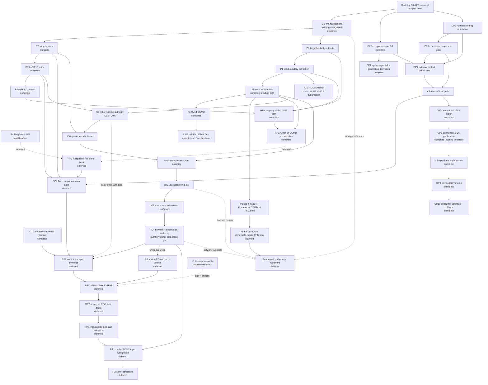

# Slime OS roadmap

This directory is the canonical plan for Slime OS. The current physical execution goal is:

> **Restore the x86-64 upstream-seL4 product path under pinned QEMU q35/OVMF, build one identity-bound UEFI removable-media image, and boot that exact image on the named Framework without modifying internal storage.**

The Milk-V Duo architecture lane is complete through P3.F and remains retained evidence. [P6](07-architecture-portability.md#p6-x86-64-sel4-qemu-and-framework-cpu-boot) is now the active lane: QEMU target admission and semantic parity precede the removable-media image, and that exact image precedes the first Framework observation. P6 is deliberately narrower than hardware qualification; H1–H14, M5.7, Raspberry Pi 5, and every device-specific gate retain their own evidence requirements.

A milestone is complete only when its exit condition is observed. Compiled code, a custom payload, a passing QEMU run, or evidence from a different physical target cannot close a board-specific milestone.

## Current state

| Track | Status | Next open gate |
| --- | --- | --- |
| [Backlog](00-backlog.md) | B1–B91 resolved; **no open items** — B91 closed 2026-08-30 when every pinned instance binding slot gained a machine-readable, builder-verified reason (`bootLayout`/`allocatorOrder`/`encodedLayout`/`componentAbi`), leaving 260 `componentAbi` pins as the counted residue a future migration can shrink | No open backlog item gates the next milestone. B61/B63/B65 each record a deliberately deferred half a future audit should start from, and B91's devlog names the four follow-ups its classification made visible |
| [Foundations](01-foundations.md) | M1–M4 and M6 complete; M5 mechanisms complete except M5.7 physical Framework storage evidence | M5.7 follows P6.6, H1, H2, and H4; a no-storage Framework CPU boot is prerequisite, not NVMe evidence |
| [Core runtime](02-core-runtime.md) | C7 and all of C8 (C8.1–C8.15) complete; the C8 track closed 2026-08-17 with C8.14's fault-isolation envelope and C8.15's aggregate determinism gate. **C10 closed 2026-08-24** across C10.1–C10.4: one task-private 2 MiB window per child, an authenticated `private-memory-budget/v1` resource fixing every component's ceiling, a `GlobalAlloc` over that region, and adoption by `fabric-service` — the graph's own broker, in ten fixtures — which now sizes its role and frame tables from the graph a generation declares rather than from the contract's ceilings, freeing 29960 bytes of `.bss` plus `.data` per generation. A repeated spawn/exit cycle returns the frame allocator's own watermarks exactly, and a shared buffer cannot be mapped into a private window. **C9 closed 2026-08-26** across C9.1–C9.6: a root-brokered clock/timer service behind declared authority, a bounded userspace wait set that blocks once per ready set on one declared Notification and recovers every ready source from the coalesced badge word, a declared scheduling class whose band mapping is manifest data — the builder reads it once and writes the resulting priority into the `ScheduleRecord`, so a class *is* a priority rather than a second number beside one — a `lifecycle-policy/v1` transition graph, restart bound, health dependency set, and parameter authority under which a *userspace* supervisor restarts a failed component while the root charges the declared attempt and refuses everything the policy does not admit, and a generation can declare a component deterministic with the claim constrained to the authority a recorder genuinely captures. **C9.6 closed 2026-08-26**: a simulated sensor → controller → actuator graph on the `sel4-robot-runtime` plane, the controller a dual-contract-kind participant, running to completion under declared best-effort contention and surviving an injected controller restart with its fabric authority reissued, asserted by a two-boot semantic trace comparison. Both of RP5's named dependencies on this track are therefore closed. | The track is fully closed; nothing remains open. RP5's two named dependencies (C9.3, C9.4) are met, and C9.5's `recorded` source set is still clock-only — widening it is its own follow-up, not a C9 milestone.
| [Component platform](10-component-platform.md) | **CP0–CP10 complete**, closing 2026-08-25 across CP6–CP10: `contracts/component-sdk-release/v1` describes an export, `scripts/lib/component_sdk.py` is the only thing that produces one, publication exports a detached checkout of the commit it records so a mirror commit regenerates byte-for-byte, each release ships a content-addressed seL4 prefix per target profile so an external build reads nothing under `slime_os/build/`, two real releases are classified against each other with every published matrix row backed by a build plus the boot that observed it, and a template consumer upgrades, boots, survives five injected failures, and reproduces the previous ELF and generation byte-for-byte on rollback | The track is fully closed; nothing remains open. CP7's hosted-publication clause closed 2026-08-26 with SDK 1.0.0 (`5fee7b1`) and 1.1.0 (`31742d1`) as immutable commits and signed tags on the `generated` branch |
| [RPi5 ROS 2 demo](09-rpi5-ros2-demo.md) | Deferred after RP0, RP1, and RP2 completed. RP2 closed 2026-08-20 with the demo-scoped AArch64 QEMU product graph; RP3–RP8 retain their original Raspberry Pi 5 acceptance conditions | Resume at RP3 when a working USB-UART evidence path is available and the physical demo is reprioritized |
| [Architecture portability](07-architecture-portability.md) | The AArch64 and RV64 lanes are retained; P3.D–P3.F physically qualified the Milk-V Duo. P6 is open to restore x86-64 upstream seL4 from pinned QEMU pc99/OVMF through one reproducible Framework removable-media CPU/product boot | P6.1 — admit and reproducibly build the `x86_64-sel4-qemu-pc99` kernel, root, child, generation, and target identity |
| [Native I/O substrate](11-io-substrate.md) | IO0–IO3 and IO5–IO7 complete; **IO4 is complete only for its exact-destination authority boundary and its network data plane is unfinished**. IO2's root cutover closed 2026-08-29, and IO5/IO6/IO7 added the track's host verification layers the same day. Five QEMU gates: `io_queue_check`, `io_driver_authority_check`, `io_block_check`, `io_link_check`, `io_network_check`, all registered in `sel4_gate_control_check`; two host model gates, `io_queue_model_check` and `io_resource_model_check`, registered in `contracts_check`; two host proof gates, `kani_io_proofs` and `kani_virtio_proofs` | IO0 fixes request/epoch/lease/queue semantics; IO1 grants bounded device/MMIO/IRQ/DMA authority with numeric reclamation on death; IO2's userspace virtio-blk is now the only product block path; IO3 proves userspace virtio-net duplex on the same substrate; IO4 enforces exact-destination networking, with IPv6/DHCP/SLAAC/listen declared and refused, but Ethernet framing, ARP, IPv4, ICMP, UDP, TCP, and exact-name DNS are unimplemented and unclaimed, so R0/RP5 cannot yet obtain a byte stream from it; IO5 quantifies IO0's lease/epoch rules and IO1's charge conservation over every interleaving rather than one schedule, with 13 must-fail mutations; IO6 proves the wire arithmetic those models disclaim — slot indexing, cursor subtraction, slice bounds — of the shipped source over every value of the declared types, with 18 must-fail mutations; IO7 closes the *device* side after B86/B87 showed it unguarded, proving used-ring index, descriptor-id, and transfer-length handling over all values with 13 harnesses and 8 must-fail mutations. All trusted-DMA on QEMU — no containment claim |
| [ROS 2 compatibility](03-ros2-compatibility.md) | Deferred with the RPi5 demo | Resume R0/IO4 transport work when the robotics demo is reprioritized; the frozen contract and completed authority work remain valid |
| [Platform hardware](04-platform-hardware.md) | Planned behind P6.6; H1 begins only after the QEMU-proven removable image boots the resident product graph on Framework without internal-storage writes | P6.6 unblocks H1; H1 then records the real ACPI/PCI/APIC/IOMMU/NVMe/input topology and no-write evidence |
| [Foreign workloads](05-foreign-workloads.md) | Deferred | Resume only for a selected product workload that needs a Linux userspace personality |
| [Authority and trust](06-authority-trust.md) | Deferred | Resume when a selected product or hardware release needs a specific authority primitive |
| [Native development](08-native-development.md) | Deferred | Resume after a physical product path is stable enough to justify on-device build and live-update work |

## Physical bring-up sequencing

The completed P3/P3.E Milk-V Duo sequence remains the physical RV64 baseline. The active x86-64 sequence is:

1. **P6.1 target contract:** pin the pc99 seL4 kernel, Rust target specifications, QEMU q35/OVMF facts, and exact QEMU/Framework target profiles.
2. **P6.2 Multiboot:** boot seL4 plus `slime-root` through one GRUB Multiboot2 EFI layout shared by QEMU and removable media.
3. **P6.3 native execution:** port child VSpace, fault decoding, task context, thread pointer, timer, and reclamation to x86-64.
4. **P6.4 semantic parity:** replay the resident product graph and selected architecture-neutral corpus under QEMU.
5. **P6.5 removable image:** build one deterministic GPT/ESP image and boot that exact raw image under QEMU/OVMF.
6. **P6.6 physical CPU boot:** boot the same image on the named Framework without input or internal-storage write authority; record exact image, generation, firmware, machine, USB identity, and no-write evidence.
7. **H1 boundary:** only after P6.6, inventory and qualify the actual firmware and devices. CPU boot does not imply PCI, DMA, keyboard, NVMe, network, display, or daily-driver support.

The [backlog](00-backlog.md) still sits ahead of all lanes: resolve or explicitly defer open defects before opening a new roadmap gate. A green verification suite is a precondition for milestone work, not a milestone itself.

## Track map

```mermaid
flowchart TD
    Backlog["Backlog: B1–B91 resolved\nno open items"]
    Foundations["M1–M6 foundations\nexisting x86/QEMU evidence"]
    C7["C7 sample plane\ncomplete"]
    C8["C8.1–C8.15 fabric\ncomplete"]
    P0["P0 target/artifact contracts"]
    P1["P1 x86 boundary extraction"]
    P2["P2.1–P2.2 AArch64\nhistorical; P2.3–P2.6 superseded"]
    P5["P5 seL4 substitution\ncomplete; product path"]
    P6["P6 x86-64 seL4 + Framework CPU boot\nP6.1 next"]
    P4["P4 Raspberry Pi 5 qualification"]
    C9["C9 robot runtime authority\nC9.1–C9.6"]
    C10["C10 private component memory\ncomplete"]
    IO0["IO0 queue, epoch, lease"]
    IO1["IO1 hardware resource authority"]
    IO2["IO2 userspace virtio-blk"]
    IO3["IO3 userspace virtio-net + LinkDevice"]
    IO4["IO4 network + destination authority\nauthority done; data plane open"]
    CP0["CP0 component-spec/v1\ncomplete"]
    CP1["CP1 system-spec/v1 + generation derivation\ncomplete"]
    CP2["CP2 runtime binding resolution"]
    CP3["CP3 crate-per-component SDK"]
    CP4["CP4 external artifact admission"]
    CP5["CP5 out-of-tree proof"]
    CP6["CP6 deterministic SDK export\ncomplete"]
    CP7["CP7 permanent SDK publication\ncomplete (hosting deferred)"]
    CP8["CP8 platform prefix assets\ncomplete"]
    CP9["CP9 compatibility matrix\ncomplete"]
    CP10["CP10 consumer upgrade + rollback\ncomplete"]
    R0["R0 minimal Zenoh topic profile\ndeferred"]
    RP0["RP0 demo contract\ncomplete"]
    RP1["RP1 target-qualified build path\ncomplete"]
    RP2["RP2 AArch64 QEMU product slice\ncomplete"]
    RP3["RP3 Raspberry Pi 5 serial boot\ndeferred"]
    RP4["RP4 Arm component data path\ndeferred"]
    RP5["RP5 node + transport envelope\ndeferred"]
    RP6["RP6 minimal Zenoh nodes\ndeferred"]
    RP7["RP7 observed RPi5 data demo\ndeferred"]
    RP8["RP8 repeatability and fault envelope\ndeferred"]
    R1["R1 broader ROS 2 topic wire profile\ndeferred"]
    R2["R2 services/actions\ndeferred"]
    Framework["Framework daily-driver hardware\ndeferred"]
    RV64["P3 RV64 QEMU\ncomplete"]
    Duo["P3.E seL4 on Milk-V Duo\ncomplete architecture lane"]
    FrameworkCPU["P6.6 Framework removable-media CPU boot\nplanned"]
    X1["X1 Linux personality\noptional/deferred"]

    Backlog --> Foundations
    Foundations --> C7 --> C8
    Foundations --> P0 --> P1 --> P5
    P1 --> P2
    P5 --> RV64 --> Duo
    P5 --> P6 --> FrameworkCPU --> Framework
    C8 --> RP0
    P0 --> RP1
    P1 --> RP1
    RP0 --> RP1 --> RP2 -.->|deferred| RP3 --> RP4 --> RP5 --> RP6 --> RP7 --> RP8
    P5 --> RP2
    P4 -.->|deferred| RP3
    C7 --> RP4
    C8 --> RP4
    Backlog --> CP0
    Backlog --> CP2
    CP0 --> CP1
    CP2 --> CP3
    CP0 --> CP4
    CP2 --> CP4
    CP3 --> CP4
    CP3 --> CP5
    CP4 --> CP5
    CP5 --> RP4
    CP5 --> CP6 --> CP7 --> CP8 --> CP9 --> CP10
    C8 --> C9
    P5 --> C9
    C10 --> RP5
    C7 --> IO0
    C9 --> IO0
    P5 --> IO1
    IO0 --> IO1 --> IO2 --> IO3 --> IO4
    IO4 --> RP5
    C9 -.->|clock/timer, wait sets| RP5
    IO4 -.->|when resumed| R0 --> RP6
    X1 -.->|only if chosen| RP6
    RP8 --> R1 --> R2
    IO4 --> R1
    Foundations -.->|storage invariants| Framework
    IO2 -.->|block substrate| Framework
    IO4 -.->|network substrate| Framework
```

## RPi5 ROS 2 demo boundary

The demo is intentionally narrower than “full ROS 2 support”:

- It proves **two local Slime-hosted ROS 2 nodes** on Raspberry Pi 5 exchanging one or more bounded topic samples through the admitted minimal bounded Zenoh profile.
- The selected route must be generation-declared, target-qualified, and carried by a real ROS 2 middleware wire protocol. Native C8 fabric may back internal delivery, but the demo cannot be claimed from a local-only ROS-like API that skips the middleware wire entirely.
- The transport family is replaceable generation data rather than an architectural commitment: `contracts/rpi5-ros2-demo/v2` names it through a closed discriminator plus one optional profile per admitted family.
- It does **not** require arbitrary middleware discovery, a Zenoh router, gossip or multicast scouting, liveliness tokens, unrestricted LAN communication, multiple middleware vendors, services/actions, unmodified desktop ROS packages, Python, Gazebo, compositor support, Wi-Fi, GPU acceleration, or Framework hardware support.
- It does not put ROS or middleware concepts in the kernel. Nodes, topics, sessions, publishers/subscribers, executors, QoS policy, and graph metadata remain userspace contracts over capabilities, C8 routes, and exact stream/network grants.
- A Raspberry Pi 5 run must be physical evidence for the named board; `aarch64-qemu-virt` evidence is necessary regression coverage but cannot replace it.

## Architectural invariants

Every track preserves these rules:

1. Privileged mechanism only: seL4 owns scheduling, address spaces, memory objects, capability enforcement, IPC, interrupts, and timers; `slime-root` owns the dynamic mechanism above them — generation admission, task/resource construction and reclamation, bounded object allocation, shared buffers, explicit hardware-resource grants, and fault supervision. Neither owns device semantics or policy.
2. Device, filesystem, generation, graph, discovery, QoS policy, health, activation, rollback, and ROS node policy live in userspace services. Drivers consume explicit hardware capabilities and expose typed semantic capabilities; shared queues, leases, completions, Notifications, and WaitSets do not create a generic device protocol.
3. Authority is carried by explicit capabilities. There are no ambient executable paths, storage handles, device enumeration, DMA addresses, working directories, streams, network destinations, discovery domains, or environment state.
4. New object kinds or rights update `../docs/capability-matrix.md`, and new or renumbered operations update `../docs/syscall-abi.md`, in the same change, and ship with a real gate. Both are now gated rather than trusted: the rights vocabulary and the operation-label table are declared in `../contracts/` and generated, and `just contracts_check` fails when `syscall-abi.md` does not document every declared label (B57, B59).
5. New IPC, I/O, ROS profile, demo trace, and persistent protocols are schema-first under `../contracts/`; generated or validated bindings cannot disagree on layout. Device-specific requests remain separate protocols and never become variants of one universal opcode.
6. Generation, storage, protocol, queue, request epoch, lease, retry, history, payload, and demo evidence data are deterministic, versioned, bounded, integrity checked, and rejected when malformed, stale, or unsupported.
7. Activation never overwrites the running generation in place, and a failed pending generation cannot consume the last selectable boot root. A generation in a superseded wire format counts as failed: the root refuses it (`UnsupportedVersion`, distinct from `BadMagic`) rather than migrating it, and the selector spends the pending attempt before decoding, so an undecodable candidate rolls back to known-good within its declared attempts instead of retrying forever. Format bumps are therefore *not* rollback-compatible by migration — they are rollback-*safe* by refusal, which `just sel4_boot_selection_check` observes (B64). Superseded `contracts/generation/vN` schemas are retained as format history and type-checked, never generated from.
8. QEMU cannot complete a physical milestone, and evidence from Milk-V Duo, Raspberry Pi 5, or Framework cannot complete another board's target-specific gate.
9. Every executable generation names one exact admitted target profile; the immutable disk-backed selector and root admission reject architecture, ABI, page-profile, and required-feature mismatches before mapping executable bytes.
10. Architecture ports preserve the same capability, fault, wait/wake, resource-reclamation, generation, and rollback semantics. ISA-specific register frames and page tables are mechanisms, not portable contracts.
11. ROS wire or node interoperability is not authority. Names, types, domains, graph visibility, parameters, files, devices, and network destinations grant nothing without explicit capabilities.
12. Component memory obtained at runtime is task-private, generation-bounded, never executable, and fully reclaimed on termination. Growth is a budgeted mechanism, not an ambient allocator.

## Release gates

### RV64 Milk-V Duo architecture release

Requires P3, P3.D, and P3.E. The release must boot a target-qualified verified generation through upstream seL4 on the named Duo, reach `slime-root` ready, reject incompatible artifacts before mapping executable bytes, and replay the selected architecture-neutral root/component corpus with physical serial evidence. It does not claim a product workload or qualify untested storage, USB, network, display, sensor, or actuator paths.

### RPi5 ROS 2 two-node demo release

Deferred, with RP0–RP2 retained as completed evidence. It still requires RP0–RP8 and the IO slices RP5 consumes; only a physical Raspberry Pi 5 run can satisfy its board-specific release claim. Duo or QEMU evidence cannot substitute.

### AArch64 native architecture release

Requires P0, P1, and P2. It remains valid architecture evidence for `aarch64-qemu-virt`, but is not Raspberry Pi 5 or Milk-V Duo hardware evidence.

### ROS-interoperable external wire release

Deferred with the robotics demo unless explicitly reprioritized. R0 proves the minimum topic path; R1/R2 broaden it to external `rmw_zenoh` peers, services, and actions.

### x86-64 Framework CPU/product boot release

Planned through P6.1–P6.6. It requires the QEMU semantic corpus, one deterministic GPT/EFI image booted under OVMF, and two cold boots of that exact image on the named Framework with target-qualified root/component evidence and an unchanged internal-NVMe comparison region. It claims no device inventory or device support.

### Framework daily-driver release

Deferred behind the CPU/product boot release. It still requires H1–H14 plus the common IO slices each H milestone consumes; M5.7 separately gates the storage-aware boot. No P6, Duo, QEMU, or CPU-only evidence satisfies a Framework device gate.

### Existing-workload release

Deferred unless selected as the implementation route for a future product workload. Any backend must be admitted for that workload's exact target profile rather than inherited from x86-64 or another architecture.

## Verification policy

Use the narrowest target named by each slice. Permanent Rust changes also run the repository format and lint gates. Generation or contract changes run `just generation_check` and `just contracts_check`. P6 requires the target-specific QEMU gate before media construction, QEMU boot of the exact raw media before physical use, and the recorded Framework no-write boot before H1. Milk-V Duo, Raspberry Pi 5, and Framework evidence remain target-specific and cannot substitute for one another.

Documentation-only roadmap edits do not run runtime tests; their verification is link, status, identifier, and content consistency, currently guarded by `just devlog_check` when devlog entries are added or touched.

## Updating this roadmap

- Update the owning track file, not this index, for detailed deliverables and checks.
- Update this index when track status, dependency edges, or release composition changes.
- Preserve completed evidence; do not rewrite an observed check as a future intention.
- When a milestone turns Complete, replace its specification body with the outcome: `**Status:**`, one `**Delivered:**` sentence, one `**Exit condition (observed):**` sentence, a `**Gates:**` line naming the exact Justfile targets, and an `**Evidence:**` link to the devlog entry. Delete the `Deliverables`, `Required checks`, and `Verification target` sections — they described work that is now done, and `01-foundations.md` is the reference for the resulting shape.
- `Preserve completed evidence` is satisfied by a reachable devlog link, not by retaining the specification prose in this directory. A completed milestone whose evidence is only readable here has not been recorded properly.
- Move exploratory work from `../docs/directions/` only after it has dependencies, bounded deliverables, required checks, and an observable exit condition here.
- Never mark a milestone complete from implementation status alone when its exit condition requires QEMU or physical evidence.
