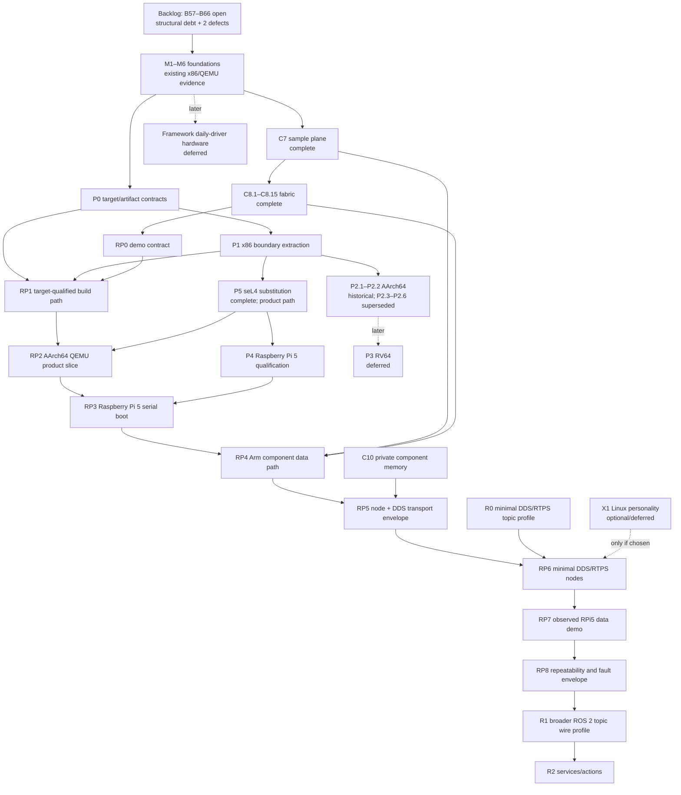

# Slime OS roadmap

This directory is the canonical plan for Slime OS. The near-term product goal is now a concrete robotics demonstration:

> **Boot Slime OS on a Raspberry Pi 5 and run two local ROS 2 nodes that exchange bounded topic data through a minimal DDSI-RTPS/XCDR profile.**

Everything below is ordered around that acceptance test. Completed x86-64/QEMU work remains valuable regression evidence, but it is no longer the product-leading path. Framework daily-driver work, broad external ROS compatibility beyond the minimum DDS/RTPS topic path, RV64, foreign workloads, and distributed authority are deferred unless they directly de-risk the Raspberry Pi 5 ROS 2 two-node demo.

A milestone is complete only when its exit condition is observed. Compiled code, a framebuffer demo, a passing host unit test, or an x86-only QEMU run cannot close a Raspberry Pi 5 milestone.

## Current state

| Track | Status | Next open gate |
| --- | --- | --- |
| [Backlog](00-backlog.md) | B1–B56 resolved; B57–B66 opened 2026-08-17 by a structural audit | B57 duplicate `RIGHT_ALL` admits an undefined rights bit; B59 single-source syscall ABI is the highest-leverage item |
| [Foundations](01-foundations.md) | M1–M4 and M6 complete; M5 mechanisms complete except M5.7 physical Framework evidence | M5.7 requires observed removable-media Framework boot without internal-NVMe writes |
| [Core runtime](02-core-runtime.md) | C7 and all of C8 (C8.1–C8.15) complete; the C8 track closed 2026-08-17 with C8.14's fault-isolation envelope and C8.15's aggregate determinism gate (280 byte-identical trace records across four boots) | C9 robot runtime authority, then C10 private component memory |
| [RPi5 ROS 2 demo](09-rpi5-ros2-demo.md) | RP0 and RP1 complete; RP2 rewritten around the seL4 product boundary (2026-08-16) and largely satisfied by P5, owing only a demo-scoped replay plus AArch64 rollback and wrong-target arms; RP3–RP8 planned | RP2's rollback and wrong-target arms on an AArch64 generation pair |
| [Architecture portability](07-architecture-portability.md) | P0, P1, P2.1, P2.2, and P5 complete; P2.3–P2.6 superseded by P5 | P4 physical Raspberry Pi 5 qualification is the next architecture evidence gate |
| [ROS 2 compatibility](03-ros2-compatibility.md) | Not started | R0 minimal DDS/RTPS topic profile is first; broader external/multi-vendor compatibility follows after the RPi5 demo path |
| [Platform hardware](04-platform-hardware.md) | Deferred; H1 is blocked and no current seL4 Framework inventory or physical evidence exists | H1 remains blocked until a seL4 Framework image and observed inventory/no-write record exist |
| [Foreign workloads](05-foreign-workloads.md) | Deferred | Use only if the chosen ROS 2 node route requires a Linux userspace personality |
| [Authority and trust](06-authority-trust.md) | Deferred | Resume after the demo unless a demo milestone needs a specific authority primitive |
| [Native development](08-native-development.md) | Deferred | Resume after the demo; D2/D3 may be useful later for on-device ROS node builds |

## Demo-first sequencing

The active lane is now the [RPi5 ROS 2 demo track](09-rpi5-ros2-demo.md). Work should be selected by whether it closes one of these risks, in this order:

1. **Target contract:** pin the exact Raspberry Pi 5 board/firmware/media path, ROS 2 distribution, node API subset, message type, and observed success transcript.
2. **Target-qualified artifacts:** make the generation, release, kernel image, and component images reject wrong-architecture binaries before mapping executable bytes.
3. **AArch64 QEMU boot:** already established by P5 on `aarch64-sel4-qemu-virt`, where seL4 owns EL1/EL0 transitions, the MMU, exceptions, timers, interrupts, and UART. What remains demo-scoped is one generation exercising the component-launch and data path together, plus rollback and wrong-target rejection on that profile.
4. **Raspberry Pi 5 physical boot:** build the `bcm2712` seL4 kernel/loader from the existing pins and platform config, bring up serial logging, the interrupt/timer path, and a no-ambient-storage removable-media boot on the named board.
5. **Two-component data path on Arm:** run two isolated components exchanging a bounded C7/C8 sample on AArch64 and then on the Pi.
6. **Node and DDS transport envelope:** provide only the allocator, startup, clock/timer, executor, bounded datagram/network path, and packaging surface needed by the pinned ROS 2 DDS profile.
7. **Minimal DDS/RTPS topic profile:** implement the fixed participant/writer/reader, XCDR1, RTPS DATA, bounded discovery, and QoS subset for two nodes without introducing ambient DDS discovery, POSIX paths, or wildcard network authority.
8. **Observed demo:** record the Raspberry Pi 5 run where one node publishes DDS-backed topic data and the other receives it, with bounded semantic/RTPS evidence and failure markers.
9. **Hardening:** repeat the run, inject denial/restart/resource cases, and make the narrow RPi5 gates stable before resuming broader tracks.

The [backlog](00-backlog.md) still sits ahead of all lanes: resolve or explicitly defer open defects before opening a new roadmap gate. A green verification suite is a precondition for milestone work, not a milestone itself.

## Track map

```mermaid
flowchart TD
    Backlog["Backlog: B57–B66 open\nstructural debt + 2 defects"]
    Foundations["M1–M6 foundations\nexisting x86/QEMU evidence"]
    C7["C7 sample plane\ncomplete"]
    C8["C8.1–C8.15 fabric\ncomplete"]
    P0["P0 target/artifact contracts"]
    P1["P1 x86 boundary extraction"]
    P2["P2.1–P2.2 AArch64\nhistorical; P2.3–P2.6 superseded"]
    P5["P5 seL4 substitution\ncomplete; product path"]
    P4["P4 Raspberry Pi 5 qualification"]
    C10["C10 private component memory"]
    R0["R0 minimal DDS/RTPS topic profile"]
    RP0["RP0 demo contract"]
    RP1["RP1 target-qualified build path"]
    RP2["RP2 AArch64 QEMU product slice"]
    RP3["RP3 Raspberry Pi 5 serial boot"]
    RP4["RP4 Arm component data path"]
    RP5["RP5 node + DDS transport envelope"]
    RP6["RP6 minimal DDS/RTPS nodes"]
    RP7["RP7 observed RPi5 data demo"]
    RP8["RP8 repeatability and fault envelope"]
    R1["R1 broader ROS 2 topic wire profile"]
    R2["R2 services/actions"]
    Framework["Framework daily-driver hardware\ndeferred"]
    RV64["P3 RV64\ndeferred"]
    X1["X1 Linux personality\noptional/deferred"]

    Backlog --> Foundations
    Foundations --> C7 --> C8
    Foundations --> P0 --> P1 --> P5 --> P4
    P1 --> P2
    C8 --> RP0
    P0 --> RP1
    P1 --> RP1
    RP0 --> RP1 --> RP2 --> RP3 --> RP4 --> RP5 --> RP6 --> RP7 --> RP8
    P5 --> RP2
    P4 --> RP3
    C7 --> RP4
    C8 --> RP4
    C10 --> RP5
    R0 --> RP6
    X1 -.->|only if chosen| RP6
    RP8 --> R1 --> R2
    P2 -.->|later| RV64
    Foundations -.->|later| Framework
```

## RPi5 ROS 2 demo boundary

The demo is intentionally narrower than “full ROS 2 support”:

- It proves **two local Slime-hosted ROS 2 nodes** on Raspberry Pi 5 exchanging one or more bounded topic samples through the admitted minimal DDSI-RTPS/XCDR profile.
- The selected route must be generation-declared, target-qualified, and DDS-backed. Native C8 fabric may back internal delivery, but the demo cannot be claimed from a local-only ROS-like API that skips DDS/RTPS entirely.
- It does **not** require arbitrary DDS discovery, unrestricted LAN communication, multiple middleware vendors, services/actions, unmodified desktop ROS packages, Python, Gazebo, compositor support, Wi-Fi, GPU acceleration, or Framework hardware support.
- It does not put ROS or DDS concepts in the kernel. Nodes, topics, participants, writers/readers, executors, QoS policy, and graph metadata remain userspace contracts over capabilities, C8 routes, and exact datagram/network grants.
- A Raspberry Pi 5 run must be physical evidence for the named board; `aarch64-qemu-virt` evidence is necessary regression coverage but cannot replace it.

## Architectural invariants

Every track preserves these rules:

1. Privileged mechanism only: seL4 owns scheduling, address spaces, memory objects, capability enforcement, IPC, interrupts, and timers; `slime-root` owns the dynamic mechanism above them — generation admission, task construction and reclamation, bounded object allocation, shared buffers, and fault supervision. Neither owns policy.
2. Device, filesystem, generation, graph, discovery, QoS policy, health, activation, rollback, and ROS node policy live in userspace services.
3. Authority is carried by explicit capabilities. There are no ambient executable paths, storage handles, working directories, streams, network destinations, discovery domains, or environment state.
4. New object kinds or rights update `../docs/capability-matrix.md`, and new or renumbered operations update `../docs/syscall-abi.md`, in the same change, and ship with a real gate.
5. New IPC, ROS profile, demo trace, and persistent protocols are schema-first under `../contracts/`; generated or validated bindings cannot disagree on layout.
6. Generation, storage, protocol, queue, retry, history, payload, and demo evidence data are deterministic, versioned, bounded, integrity checked, and rejected when malformed or unsupported.
7. Activation never overwrites the running generation in place, and a failed pending generation cannot consume the last selectable boot root.
8. A QEMU pass cannot complete a physical Raspberry Pi 5 or Framework milestone.
9. Every executable generation names one exact admitted target profile; stage-0 rejects architecture, ABI, page-profile, and required-feature mismatches before mapping executable bytes.
10. Architecture ports preserve the same capability, fault, wait/wake, resource-reclamation, generation, and rollback semantics. ISA-specific register frames and page tables are mechanisms, not portable contracts.
11. ROS wire or node interoperability is not authority. Names, types, domains, graph visibility, parameters, files, devices, and network destinations grant nothing without explicit capabilities.
12. Component memory obtained at runtime is task-private, generation-bounded, never executable, and fully reclaimed on termination. Growth is a budgeted mechanism, not an ambient allocator.

## Release gates

### RPi5 ROS 2 two-node demo release

Requires RP0–RP8. The release must boot a target-qualified Slime OS generation from reproducible Raspberry Pi 5 media, run two local ROS 2 nodes under the selected generation-declared minimal DDS/RTPS route, move bounded DDS topic data from publisher to subscriber, emit deterministic semantic and RTPS evidence of the exchange, and preserve the capability/component/generation invariants above. QEMU evidence and host checks support the claim but do not replace the physical board run.

### AArch64 native architecture release

Requires P0, P1, and P2. It is a prerequisite for the RPi5 demo path but is not sufficient by itself: it proves `aarch64-qemu-virt`, not Raspberry Pi 5 hardware.

### ROS-interoperable external wire release

Requires the minimal RPi5 DDS demo path to be stable unless explicitly reprioritized, then R1 and R2 with their deterministic peer fixtures. R0 proves the minimum DDS/RTPS topic path; R1/R2 broaden it to external peers, more vendors, services, and actions.

### Framework daily-driver release

Deferred. It still requires the Framework H1–H14 evidence if resumed, but it is no longer on the near-term critical path.

### Existing-workload release

Deferred unless selected as the implementation route for RP6. If used, X1 or a target-specific alternative must be admitted for Raspberry Pi 5/AArch64, not inherited from x86-64.

## Verification policy

Use the narrowest target named by each slice. Permanent Rust changes also run the repository format and lint gates. Generation or contract changes run `just generation_check` and `just contracts_check`. Architecture changes run the target-specific QEMU gate before any physical board claim. Raspberry Pi 5 promotion requires a recorded board run with exact image, firmware/media, generation identity, serial output, and declared device/storage authority.

Documentation-only roadmap edits do not run runtime tests; their verification is link, status, identifier, and content consistency, currently guarded by `just devlog_check` when devlog entries are added or touched.

## Updating this roadmap

- Update the owning track file, not this index, for detailed deliverables and checks.
- Update this index when track status, dependency edges, or release composition changes.
- Preserve completed evidence; do not rewrite an observed check as a future intention.
- Move exploratory work from `../docs/directions/` only after it has dependencies, bounded deliverables, required checks, and an observable exit condition here.
- Never mark a milestone complete from implementation status alone when its exit condition requires QEMU or physical evidence.
