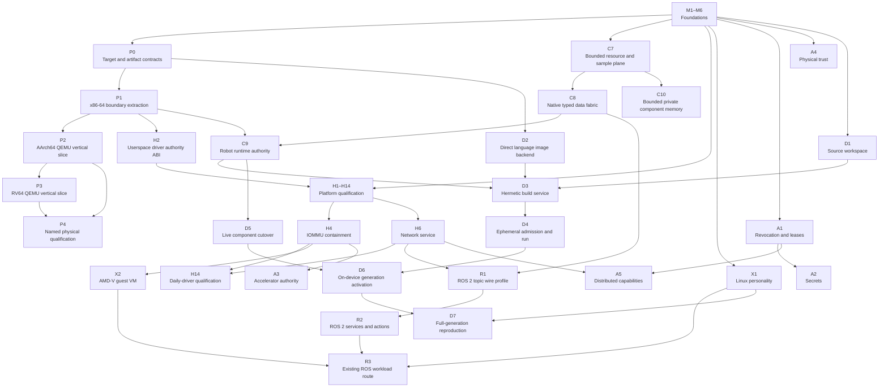
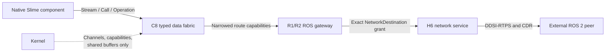

# Slime OS roadmap

This directory is the canonical plan for Slime OS. It separates mechanism, protocol compatibility, physical-platform qualification, foreign workloads, and authority work so unrelated hardware does not impose a false total order on the system architecture.

A milestone is complete only when its exit condition is observed. Compiled code, a framebuffer demo, or a narrowed unit test is not completion. QEMU is the deterministic architecture target; a physical support claim additionally requires recorded behavior on the named Framework target.

## Current state

| Track | Status | Next open gate |
| --- | --- | --- |
| [Backlog](00-backlog.md) | B9 open (terminated tasks are never reaped); B1–B8 resolved | Reclaim terminated-task frames before opening C10 |
| [Foundations](01-foundations.md) | M1–M4 and M6 complete; M5 mechanisms complete | Record M5.7 removable-media Framework evidence without internal-NVMe modification |
| [Core runtime](02-core-runtime.md) | C7 complete; C8.1–C8.3 complete — one authenticated generation resource fixes every native interface, graph edge, QoS policy, visibility grant, interposition hop, and resource ceiling, and a live userspace fabric derives exact non-widening, non-transferable route roles from it. C10 is planned, not started | Begin C8.4 bounded many-to-many streams; C10 opens after B9 |
| [Architecture portability](07-architecture-portability.md) | Not started | Clear the active backlog, then land P0 target/artifact contracts before P1 x86 boundary extraction |
| [ROS 2 compatibility](03-ros2-compatibility.md) | Not started | Admit R1 only after C8 and the H6 network-service contract exist |
| [Platform hardware](04-platform-hardware.md) | H1 implementation complete; physical evidence pending | Record H1 topology/input/storage evidence; implement H2 driver authority ABI |
| [Foreign workloads](05-foreign-workloads.md) | Not started | X1 Linux userspace personality |
| [Authority and trust](06-authority-trust.md) | Not started | A1 revocation/leases and A2 secrets after their core dependencies |
| [Native development](08-native-development.md) | Not started | Begin D1 in-system source workspace; D2 direct image emission follows P0 |

The active work lanes are deliberately parallel:

- **Evidence lane:** close M5.7 and H1 with an observed removable-media Framework run.
- **Core lane:** the C7 backlog is clear; C8.1–C8.3 have landed, so C8.4 bounded many-to-many streams is the next open slice. C10 private component memory is planned and independent of C8/C9, but waits on B9.
- **Portability lane:** after the backlog gate, land P0/P1 before H2 or C9 establishes more low-level contracts; AArch64 P2 follows without blocking C8.
- **Platform lane:** record H1 physical evidence, then implement H2 only after P1; H4 still gates DMA-capable Framework promotion.
- **Development lane:** D1 source authoring can begin from completed M6; D2 waits for P0's producer-neutral artifact contract, and hermetic build/live activation consume C9.
- **Memory lane:** B9 first, then C10 gives components a generation-bounded private heap so working memory stops being a build-time constant. It consumes only C7's quota pattern, so it does not queue behind the fabric.

No lane may use progress in another lane to claim an unobserved exit condition.

The [backlog](00-backlog.md) sits ahead of all lanes: resolve or explicitly defer its open defects before opening a new track gate. Backlog items restore an already claimed exit condition or remove debt that would compound under new work; they are not new capability.

## Track map


```mermaid
flowchart TD
    Foundations["M1–M6<br/>Foundations"]
    P0["P0<br/>Target and artifact contracts"]
    P1["P1<br/>x86-64 boundary extraction"]
    P2["P2<br/>AArch64 QEMU vertical slice"]
    P3["P3<br/>RV64 QEMU vertical slice"]
    P4["P4<br/>Named physical qualification"]

    C7["C7<br/>Bounded resource and sample plane"]
    C8["C8<br/>Native typed data fabric"]
    C9["C9<br/>Robot runtime authority"]
    C10["C10<br/>Bounded private component memory"]
    H2["H2<br/>Userspace driver authority ABI"]

    R1["R1<br/>ROS 2 topic wire profile"]
    R2["R2<br/>ROS 2 services and actions"]
    R3["R3<br/>Existing ROS workload route"]

    Hardware["H1–H14<br/>Platform qualification"]
    H4["H4<br/>IOMMU containment"]
    H6["H6<br/>Network service"]
    H14["H14<br/>Daily-driver qualification"]

    X1["X1<br/>Linux personality"]
    X2["X2<br/>AMD-V guest VM"]

    A1["A1<br/>Revocation and leases"]
    A2["A2<br/>Secrets"]
    A3["A3<br/>Accelerator authority"]
    A4["A4<br/>Physical trust"]
    A5["A5<br/>Distributed capabilities"]
    D1["D1<br/>Source workspace"]
    D2["D2<br/>Direct language image backend"]
    D3["D3<br/>Hermetic build service"]
    D4["D4<br/>Ephemeral admission and run"]
    D5["D5<br/>Live component cutover"]
    D6["D6<br/>On-device generation activation"]
    D7["D7<br/>Full-generation reproduction"]

    Foundations --> P0 --> P1 --> P2 --> P3
    P2 --> P4
    P3 --> P4
    P1 --> H2
    P1 --> C9

    Foundations --> C7 --> C8
    C7 --> C10
    C8 --> C9
    C8 --> R1 --> R2 --> R3

    Foundations --> Hardware
    H2 --> Hardware
    Hardware --> H4
    Hardware --> H6
    H4 --> H14
    H6 --> H14

    H6 --> R1
    Foundations --> X1 --> R3
    H4 --> X2 --> R3

    Foundations --> A1 --> A2
    H4 --> A3
    Foundations --> A4
    A1 --> A5
    H6 --> A5

    Foundations --> D1
    P0 --> D2
    D1 --> D3
    D2 --> D3
    C9 --> D3
    D3 --> D4
    C9 --> D5
    D4 --> D6
    D5 --> D6
    D6 --> D7
    X1 --> D7
```

## Architecture and embedded boundary

The [architecture portability track](07-architecture-portability.md) makes target identity and privileged mechanisms explicit without creating separate capability or generation models:

- x86-64 remains the deterministic reference architecture; AArch64 is the first non-x86 implementation and product priority; RV64 follows as a separately gated profile.
- An admitted target is a complete profile covering ISA, privilege model, page profile, firmware handoff, interrupt/timer path, and baseline devices. A generic “ARM” or “RISC-V” claim is invalid.
- Kernel and component executables are architecture-qualified and authenticated for one exact generation target. Architecture-neutral resource objects may remain byte-identical across targets.
- C7, B2, and C8 continue on x86-64 while P0/P1 are prepared. P1 gates H2 and C9 so PCI/APIC/CR3/register layouts do not become universal contracts.
- Cortex-M, RV32, and other no-MMU MCU-class devices are bounded external companions over declared serial, CAN, USB, network, micro-ROS/XRCE-DDS, or Zutai routes. They do not run a weakened version of the Slime kernel.

## ROS 2 architecture boundary


```mermaid
flowchart LR
    Native["Native Slime component"]
    Fabric["C8 typed data fabric"]
    Gateway["R1/R2 ROS gateway"]
    Network["H6 network service"]
    Peer["External ROS 2 peer"]
    Kernel["Kernel"]

    Native -->|"Stream / Call / Operation"| Fabric
    Fabric -->|"Narrowed route capabilities"| Gateway
    Gateway -->|"Exact NetworkDestination grant"| Network
    Network -->|"DDSI-RTPS and CDR"| Peer

    Kernel -.->|"Channels, capabilities,<br/>shared buffers only"| Fabric
```

Dependencies are minimum prerequisites, not permission to add ambient authority. In particular:

- ROS 2 compatibility is a userspace profile over native Slime contracts, never a kernel ABI.
- DDSI-RTPS carries typed data, not Slime capabilities. A5 distributed capabilities is a separate cryptographic authority protocol.
- Existing ROS binaries are R3 scope. R1 and R2 prove protocol interoperability without importing Linux, POSIX, a global filesystem, or an ambient network model.
- Hardware track completion never substitutes for core fault, bounds, schema, or authority checks.
- ROS wire interoperability is architecture-independent. The initial R1/R2 gate remains deterministic on the reference QEMU profile; an AArch64 replay adds heterogeneous evidence after P2 without redefining the wire profile.
- A physical Raspberry Pi acting as an external ROS peer proves heterogeneous protocol behavior, not that Slime OS supports that board.

## Architectural invariants

Every track preserves these rules:

1. The kernel owns only privileged mechanisms: scheduling, address spaces, memory objects, capability enforcement, IPC, interrupts, timers, and minimal platform control.
2. Device, filesystem, generation, graph, discovery, QoS policy, health, activation, and rollback policy live in userspace services.
3. Authority is carried by explicit capabilities. There are no ambient executable paths, storage handles, working directories, streams, network destinations, discovery domains, or environment state.
4. New kernel objects or rights update `../docs/capability-matrix.md` in the same change and ship with a real gate.
5. New IPC protocols are schema-first under `../contracts/`; generated or validated bindings cannot disagree on layout.
6. Generation, storage, protocol, queue, retry, history, and payload data are deterministic, versioned, bounded, integrity checked, and rejected when malformed or unsupported.
7. Activation never overwrites the running generation in place, and a failed pending generation cannot consume the last selectable boot root.
8. A QEMU pass cannot complete a physical-machine milestone.
9. Internal Framework NVMe writes remain disabled until the H7 bounds, IOMMU, timeout/reset, flush-ordering, interruption, identity, malformed-metadata, rollback, and recovery gates all pass.
10. Every executable generation names one exact admitted target profile; stage-0 rejects architecture, ABI, page-profile, and required-feature mismatches before mapping executable bytes.
11. Architecture ports preserve the same capability, fault, wait/wake, resource-reclamation, generation, and rollback semantics. ISA-specific register frames and page tables are mechanisms, not portable contracts.
12. MCU-class companions never gain ambient graph, network, storage, or actuator authority and do not weaken the kernel's MMU-backed isolation baseline.
13. Source languages may emit native executable images only through the admitted target/image contract. Zutai remains the only serialized-schema language, and neither source nor compiler output may mint authority.
14. Component memory obtained at runtime is task-private, generation-bounded, never executable, and fully reclaimed on termination. Growth is a budgeted mechanism, not an ambient allocator, and never yields a transferable or shareable object.

## Release gates

Track milestones compose into observable releases rather than one global milestone number.

### Reference native architecture release

Requires M1–M6, C7, C8, P0, and P1 on `x86_64-qemu-virtio`. The release must boot an exact-target generation, run isolated native components, move bounded typed samples and calls through capability-routed services, survive a peer fault, and roll back a failed pending generation. P0/P1 do not erase earlier x86 evidence; they make its target and mechanism boundary explicit before this release closes.

### AArch64 native architecture release

Requires the reference native architecture release and P2. The same architecture-neutral isolation, B2 wait/wake, C7 sample-plane, generation, release, and rollback corpus must pass on `aarch64-qemu-virt`; a successful x86 run cannot substitute.

### RV64 native architecture release

Requires the AArch64 native architecture release and P3. The pinned `riscv64-qemu-virt` profile must pass the same semantic corpus while rejecting unsupported ISA, firmware, page, interrupt, and executable assumptions explicitly.

### ROS-interoperable QEMU release

Requires the reference native architecture release, H6's deterministic virtio-net backend and network authority contract, then R1 and R2. The canonical oracle is one content-addressed host ROS 2 Jazzy peer image: Fast DDS and Cyclone DDS run the same fixed probes, network, packet capture, and malformed-input corpus. Only declared topics, services, and actions may cross; denied graph edges emit no corresponding data packet. A later AArch64 QEMU replay and wired physical runs supply heterogeneous evidence but cannot replace the deterministic L0–L3 gates.

### Framework daily-driver release

Requires H1–H14 and all physical evidence named in the hardware track. It is independent of whether existing ROS binaries run locally.

### Existing-workload release

Requires X1 or X2 plus R3 for existing ROS workloads. The workload's complete filesystem, network, time, randomness, scheduling, and device authority must be generation-declared and visible to audit tooling.

### Native development release

Requires D1–D6 and their P0/P1, C8/C9, and M5/M6 dependencies. In one QEMU boot a user must create source, compile the pinned native language directly to the admitted component format, execute it ephemerally with selected capabilities, and keep malformed or unauthorized bytes inert. A release-authorized compatible userspace generation switches one service without reboot; every excluded diff follows the ordinary pending-boot path.

### Reproducible on-device build release

Requires the native development release and D7. A clean Slime build environment must reproduce the complete reference mixed-language generation byte-for-byte from the same normalized source/toolchain closure as the host, with bounded hermetic execution and detached provenance. The current Rust closure initially consumes X1 unless a native Rust toolchain independently passes the same contract.

### Distributed-authority release

Requires A1 and A5 plus H6 networking. Revocation, partition, unreachable, and replay failures remain distinguishable structured errors; RTPS interoperability alone does not satisfy this gate.

## Verification policy

Use the narrowest target named by each slice. Permanent Rust changes also run the repository format and lint gates. Generation or contract changes run `just generation_check` and `just contracts_check`. P1–P3 run their architecture-specific QEMU target plus the shared semantic corpus; one ISA cannot close another ISA's gate. Hardware promotion includes the exact physical evidence record required by the relevant H or P4 slice.

The repository-wide gates remain:

```sh
just contracts_check
just devlog_check
just generation_check
just test
just fmt_check
just lint
just fmt_check_components
just lint_components
just framework_safety_check
```

Documentation-only roadmap edits do not run runtime tests; their verification is link, status, identifier, and content consistency.

## Updating this roadmap

- Update the owning track file, not this index, for detailed deliverables and checks.
- Update this index when track status, dependency edges, or release composition changes.
- Preserve completed evidence; do not rewrite an observed check as a future intention.
- Move exploratory work from `../docs/directions/` only after it has dependencies, bounded deliverables, required checks, and an observable exit condition here.
- Never mark a milestone complete from implementation status alone when its exit condition requires QEMU or physical evidence.
